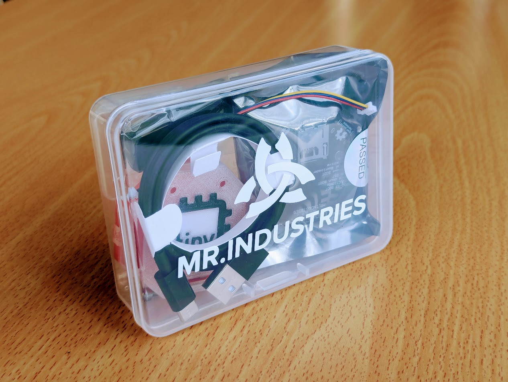

# First Time Setup

### So you bought a tinyCore...

Congratulations! (and Thank You!)

You're well on your way to building some Cool Shit™!

But before you can do that, we need to setup some stuff.

That's what this series is for. By the end of it you'll have a full assembled tinyCore, a setup development environment, and a working demo project.

Let's dive in! 

(And heck, break open the gummy bears!)