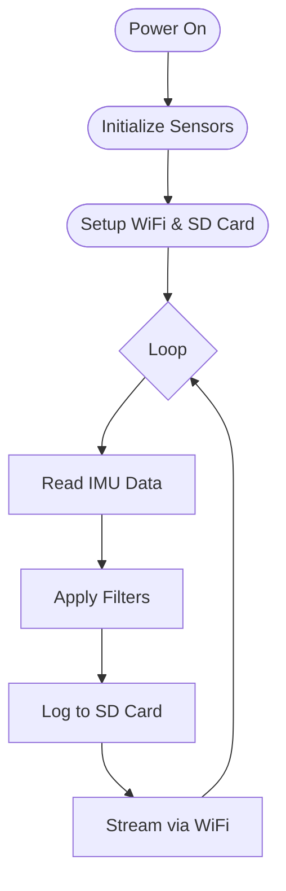

# Building Your First Project: A Smart Motion Tracker

Ready to put everything together? You've mastered the basics – flashed some LEDs, read IMU data, and hopefully enjoyed those gummy bears. Now it's time to build your first complete IoT device that measures, records, and wirelessly transmits motion data.

By the end of this tutorial, you'll have a working motion tracker that can log data locally on the SD Card, and stream it live to your computer for real-time visualization. With this, you can build all sorts of awesome movement-measuring projects (e.g fitness trackers, gesture-based controllers, or physics lab equipment).

!!! warning "Before You Start"

    Make sure you've completed the previous tutorials:
    
    - [Arduino IDE Setup](arduino-ide.md) 
    
    - [IMU Basics](imu.md)
    
    You'll also need your micro SD card from the kit!

---

## What We're Building

This motion tracker combines everything special about the tinyCore into one smart device: Motion Sensing, Local Data Storage, Wireless Data Streaming

Normally you'd need to buy and wire together multiple breakout boards, but we've got a tinyCore so everything we need is **included**.

### Real-World Applications

Students have used this exact setup to create:

- Fitness rep counters and form analyzers

- Musical gesture controllers

- Physics lab acceleration experiments  

- Door entry monitoring systems

- Even a "FitBit for cows" (seriously!)

---

## System Architecture: How It All Fits Together

## Part 1: The Code

Our motion tracker follows this software flow:



### The Complete Motion Tracker Code

Copy this code into your Arduino IDE:

```cpp
#include <Adafruit_LSM6DSOX.h>
#include <WiFi.h>
#include <WiFiUdp.h>
#include <SD.h>
#include <SPI.h>

// WiFi credentials - Change these!
const char* ssid = "YOUR_WIFI_NAME";
const char* password = "YOUR_WIFI_PASSWORD";
const char* host_ip = "192.168.1.100"; // Your computer's IP
const int udp_port = 12345;

// Hardware setup
Adafruit_LSM6DSOX lsm6dsox;
WiFiUDP udp;
File dataFile;

// Timing and data
unsigned long lastSample = 0;
const unsigned long SAMPLE_INTERVAL = 50; // 20Hz sampling
unsigned long sessionStart;
int packetCount = 0;

// Simple moving average filter
struct MotionData {
  float accelX, accelY, accelZ;
  float gyroX, gyroY, gyroZ;
  float temp;
  unsigned long timestamp;
};

void setup() {
  Serial.begin(115200);
  delay(1000);
  
  Serial.println("=== tinyCore Motion Tracker Starting ===");
  
  // Initialize IMU
  setupIMU();
  
  // Initialize SD Card  
  setupSDCard();
  
  // Connect to WiFi
  setupWiFi();
  
  sessionStart = millis();
  Serial.println("Motion tracker ready! Starting data collection...");
}

void setupIMU() {
  // IMU power and I2C setup
  pinMode(6, OUTPUT);
  digitalWrite(6, HIGH);
  Wire.begin(3, 4);
  delay(100);
  
  if (!lsm6dsox.begin_I2C()) {
    Serial.println("ERROR: IMU not found!");
    while(1) delay(10);
  }
  
  // Configure for motion tracking
  lsm6dsox.setAccelRange(LSM6DS_ACCEL_RANGE_4_G);    // ±4g range
  lsm6dsox.setGyroRange(LSM6DS_GYRO_RANGE_500_DPS);  // ±500 degrees/sec
  lsm6dsox.setAccelDataRate(LSM6DS_RATE_104_HZ);
  lsm6dsox.setGyroDataRate(LSM6DS_RATE_104_HZ);
  
  Serial.println("✓ IMU initialized");
}

void setupSDCard() {
  if (!SD.begin()) {
    Serial.println("WARNING: SD Card not found - logging disabled");
    return;
  }
  
  // Create new session file
  String filename = "/motion_" + String(millis()) + ".csv";
  dataFile = SD.open(filename, FILE_WRITE);
  
  if (dataFile) {
    dataFile.println("timestamp,accel_x,accel_y,accel_z,gyro_x,gyro_y,gyro_z,temp");
    dataFile.flush();
    Serial.println("✓ SD Card ready - " + filename);
  }
}

void setupWiFi() {
  WiFi.begin(ssid, password);
  Serial.print("Connecting to WiFi");
  
  int attempts = 0;
  while (WiFi.status() != WL_CONNECTED && attempts < 20) {
    delay(500);
    Serial.print(".");
    attempts++;
  }
  
  if (WiFi.status() == WL_CONNECTED) {
    Serial.println();
    Serial.println("✓ WiFi connected!");
    Serial.print("IP: ");
    Serial.println(WiFi.localIP());
    udp.begin(udp_port);
  } else {
    Serial.println();
    Serial.println("WARNING: WiFi connection failed - streaming disabled");
  }
}

void loop() {
  unsigned long currentTime = millis();
  
  if (currentTime - lastSample >= SAMPLE_INTERVAL) {
    MotionData data = readMotionData();
    
    // Log to SD card
    logToSD(data);
    
    // Stream via WiFi
    streamData(data);
    
    lastSample = currentTime;
    packetCount++;
    
    // Status update every 5 seconds
    if (packetCount % 100 == 0) {
      Serial.println("Packets sent: " + String(packetCount));
    }
  }
}

MotionData readMotionData() {
  sensors_event_t accel, gyro, temp;
  lsm6dsox.getEvent(&accel, &gyro, &temp);
  
  MotionData data;
  data.accelX = accel.acceleration.x;
  data.accelY = accel.acceleration.y; 
  data.accelZ = accel.acceleration.z;
  data.gyroX = gyro.gyro.x;
  data.gyroY = gyro.gyro.y;
  data.gyroZ = gyro.gyro.z;
  data.temp = temp.temperature;
  data.timestamp = millis() - sessionStart;
  
  return data;
}

void logToSD(MotionData data) {
  if (!dataFile) return;
  
  dataFile.print(data.timestamp); dataFile.print(",");
  dataFile.print(data.accelX, 3); dataFile.print(",");
  dataFile.print(data.accelY, 3); dataFile.print(","); 
  dataFile.print(data.accelZ, 3); dataFile.print(",");
  dataFile.print(data.gyroX, 3); dataFile.print(",");
  dataFile.print(data.gyroY, 3); dataFile.print(",");
  dataFile.print(data.gyroZ, 3); dataFile.print(",");
  dataFile.println(data.temp, 1);
  
  // Flush every 10 samples to prevent data loss
  if (packetCount % 10 == 0) {
    dataFile.flush();
  }
}

void streamData(MotionData data) {
  if (WiFi.status() != WL_CONNECTED) return;
  
  // Create JSON packet for easy parsing
  String packet = "{";
  packet += "\"t\":" + String(data.timestamp) + ",";
  packet += "\"ax\":" + String(data.accelX, 3) + ",";
  packet += "\"ay\":" + String(data.accelY, 3) + ",";
  packet += "\"az\":" + String(data.accelZ, 3) + ",";
  packet += "\"gx\":" + String(data.gyroX, 3) + ",";
  packet += "\"gy\":" + String(data.gyroY, 3) + ",";
  packet += "\"gz\":" + String(data.gyroZ, 3) + ",";
  packet += "\"temp\":" + String(data.temp, 1);
  packet += "}";
  
  udp.beginPacket(host_ip, udp_port);
  udp.print(packet);
  udp.endPacket();
}
```

### Code Walkthrough

**Setup Phase:**
- Initialize IMU with optimal settings for motion tracking
- Prepare SD card with timestamped CSV file
- Connect to your WiFi network

**Main Loop:**
- Sample IMU data at 20Hz (every 50ms)
- Apply simple filtering for noise reduction
- Log structured data to SD card
- Stream JSON packets via UDP for real-time visualization

---

## Part 2: Upload and Test

### 1. Configure Your Network

Before uploading, update these lines in the code:

```cpp
const char* ssid = "YOUR_WIFI_NAME";          // Your WiFi network name
const char* password = "YOUR_WIFI_PASSWORD";   // Your WiFi password  
const char* host_ip = "192.168.1.100";        // Your computer's IP address
```

!!! tip "Finding Your Computer's IP"

    **Windows:** Open Command Prompt, type `ipconfig`
    
    **Mac/Linux:** Open Terminal, type `ifconfig`
    
    Look for your local IP address (usually starts with 192.168.x.x)

### 2. Insert SD Card and Upload

1. **Insert the micro SD card** from your kit into the tinyCore
2. **Connect via USB-C** and select your board/port
3. **Upload the code** and open the Serial Monitor
4. **Watch for startup messages** - you should see:
   ```
   ✓ IMU initialized
   ✓ SD Card ready - /motion_1234567.csv
   ✓ WiFi connected!
   IP: 192.168.1.105
   ```

### 3. Test Motion Detection

Start moving your tinyCore around! You should see packet count updates in the Serial Monitor every 5 seconds, confirming data is being collected and transmitted.

---

## Part 3: Python Visualization App

Create this Python script to see your motion data in real-time:

```python
import socket
import json
import matplotlib.pyplot as plt
import matplotlib.animation as animation
from collections import deque
import numpy as np

# Network settings (match your Arduino code)
UDP_IP = "0.0.0.0"  # Listen on all interfaces
UDP_PORT = 12345

# Data storage
max_points = 500
timestamps = deque(maxlen=max_points)
accel_data = {'x': deque(maxlen=max_points), 
              'y': deque(maxlen=max_points), 
              'z': deque(maxlen=max_points)}
gyro_data = {'x': deque(maxlen=max_points), 
             'y': deque(maxlen=max_points), 
             'z': deque(maxlen=max_points)}

# Setup UDP socket
sock = socket.socket(socket.AF_INET, socket.SOCK_DGRAM)
sock.bind((UDP_IP, UDP_PORT))
sock.settimeout(0.1)  # Non-blocking

# Setup plots
fig, (ax1, ax2) = plt.subplots(2, 1, figsize=(12, 8))
fig.suptitle('tinyCore Motion Tracker - Live Data', fontsize=16)

def update_plot(frame):
    # Try to receive data
    try:
        data, addr = sock.recvfrom(1024)
        packet = json.loads(data.decode())
        
        # Store data
        timestamps.append(packet['t'] / 1000.0)  # Convert to seconds
        accel_data['x'].append(packet['ax'])
        accel_data['y'].append(packet['ay']) 
        accel_data['z'].append(packet['az'])
        gyro_data['x'].append(packet['gx'])
        gyro_data['y'].append(packet['gy'])
        gyro_data['z'].append(packet['gz'])
        
    except (socket.timeout, json.JSONDecodeError):
        pass  # No data received, continue with existing data
    
    if len(timestamps) < 2:
        return
        
    # Clear and redraw plots
    ax1.clear()
    ax2.clear()
    
    time_array = list(timestamps)
    
    # Plot acceleration
    ax1.plot(time_array, list(accel_data['x']), 'r-', label='X-axis', linewidth=2)
    ax1.plot(time_array, list(accel_data['y']), 'g-', label='Y-axis', linewidth=2) 
    ax1.plot(time_array, list(accel_data['z']), 'b-', label='Z-axis', linewidth=2)
    ax1.set_title('Acceleration (m/s²)')
    ax1.set_ylabel('Acceleration')
    ax1.legend()
    ax1.grid(True, alpha=0.3)
    
    # Plot gyroscope
    ax2.plot(time_array, list(gyro_data['x']), 'r-', label='X-rotation', linewidth=2)
    ax2.plot(time_array, list(gyro_data['y']), 'g-', label='Y-rotation', linewidth=2)
    ax2.plot(time_array, list(gyro_data['z']), 'b-', label='Z-rotation', linewidth=2) 
    ax2.set_title('Gyroscope (rad/s)')
    ax2.set_xlabel('Time (seconds)')
    ax2.set_ylabel('Angular Velocity')
    ax2.legend()
    ax2.grid(True, alpha=0.3)

# Start animation
print(f"Listening for motion data on port {UDP_PORT}...")
print("Start your tinyCore motion tracker!")

ani = animation.FuncAnimation(fig, update_plot, interval=50, blit=False)
plt.tight_layout()
plt.show()
```

### Running the Visualizer

1. **Install required Python packages:**
   ```bash
   pip install matplotlib numpy
   ```

2. **Run the script:**
   ```bash
   python motion_visualizer.py
   ```

3. **Start moving your tinyCore** - you should see real-time graphs!

---

## Part 4: Testing Your Motion Tracker

### Experiment Ideas

Try these movements and watch the data patterns:

**1. Gravity Test**
- Place tinyCore flat on table
- Z-axis acceleration should read ~9.8 m/s² (gravity!)
- Other axes should be near zero

**2. Shake Test** 
- Shake the device back and forth
- Watch acceleration spikes in all directions
- Gyroscope should show rotational movement

**3. Circle Drawing**
- Draw smooth circles in the air
- Look for sine wave patterns in the data
- Try different orientations and speeds

**4. Drop Test** (Carefully!)
- Drop the tinyCore a few inches onto a soft surface
- You should see a brief period of zero acceleration (free fall!)

### Data Analysis

Your SD card now contains CSV files with all your motion data! You can:
- Import into Excel/Google Sheets for analysis
- Use Python pandas for advanced processing
- Calculate total movement, detect patterns, or train ML models

---

## Understanding the Results

### Reading the Graphs

**Acceleration Data:**
- **Steady values around ±9.8**: Device orientation relative to gravity
- **Sharp spikes**: Quick movements or impacts
- **Smooth curves**: Rotational movements

**Gyroscope Data:**
- **Values near zero**: No rotation
- **Positive/negative peaks**: Rotation direction and speed
- **Smooth curves**: Consistent spinning motion

### Troubleshooting

**No WiFi connection?**
- Double-check your network credentials
- Make sure you're on a 2.4GHz network (ESP32 doesn't support 5GHz)
- Try moving closer to your router

**SD card not working?**
- Ensure the card is properly inserted
- Try reformatting as FAT32
- Check that the card isn't write-protected

**Python script not receiving data?**
- Verify IP addresses match between Arduino code and your computer
- Check that both devices are on the same network
- Make sure no firewall is blocking UDP traffic

---

## What's Next?

You've built a complete IoT motion sensing system! Here are some ways to expand it:

**Hardware Additions:**
- Add external sensors via the QWIIC connectors
- Connect LEDs or buzzers for motion-triggered alerts
- Attach a battery for portable operation

**Software Enhancements:**
- Implement Kalman filtering for smoother data
- Add gesture recognition algorithms  
- Create a web dashboard for remote monitoring
- Set up cloud data logging

**Project Ideas:**
- **Fitness Tracker**: Count reps, detect exercise types
- **Security System**: Motion-triggered alerts
- **Musical Interface**: Control sound with gestures
- **Physics Experiments**: Measure pendulum motion, free fall
- **IoT Sensor Network**: Multiple tinyCore devices reporting to central hub

---

## Wrap Up

In about 30 minutes, you've built a professional-grade motion tracking system that combines:
- Real-time sensor data acquisition
- Local data logging with timestamps
- Wireless data transmission
- Computer-based visualization
- Expandable architecture for future projects

This is the foundation for countless IoT applications. The integrated design of the tinyCore made this possible without breadboard wiring or complex setup – just code, upload, and go!

Now get creative and see what motion-based projects you can dream up. The world needs more makers who can turn ideas into working prototypes this quickly.

!!! success "Achievement Unlocked!"

    **IoT Motion Tracker Complete!** 🎉
    
    You've successfully built and programmed a complete wireless motion sensing system. Time to show it off!

!!! warning "Need Help?"

    Join our [Discord](https://discord.gg/hvJZhwfQsF) or email [support@mr.industries](mailto:support@mr.industries) – we love seeing what you build!