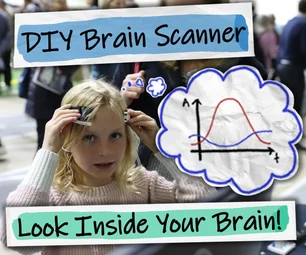
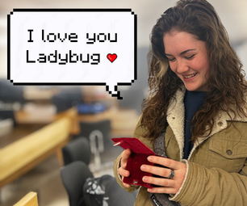

# Community Projects 👥

*Discover amazing projects built by the tinyCore community*

---

<a href="https://www.instructables.com/CyberJacket/" target="_blank" class="project-card card-cyberjacket">
  

    
  

  
CyberJacket

  
A smart RGB LED jacket with Bluetooth phone controls

  
by @GalahadGear

  
Instructables

</a>

<a href="https://www.instructables.com/Inspiring-Kids-to-Learn-About-Neuroscience-How-I-M/" target="_blank" class="project-card card-openheg">
  

    
  

  
OpenHEG

  
DIY Hemoencephalography device for brain-computer interface

  
by @FacioErgoSum

  
Instructables

</a>

<a href="https://www.instructables.com/-How-to-Make-a-Long-Distance-Message-Box-/" target="_blank" class="project-card card-messagebox">
  

    
  

  
Long Distance Message Box

  
Wireless messaging system for long distance relationships

  
by @FacioErgoSum

  
Instructables

</a>

---

## 🎯 **Example Projects**

*Tutorial projects to get you started*

<a href="../1_get-started/motion-tracker" class="project-card card-motiontracker">
  
📊

  
Motion Activity Tracker

  
Collects data + Moves

  
Official Tutorial

</a>

<a href="../advanced/ble" class="project-card card-rgbmood inactive">
  
🌈

  
RGB Mood Light

  
Lights up + Connects to phone

  
Official Tutorial

</a>

<a href="../advanced/I2S" class="project-card card-musical inactive">
  
🎵

  
Musical Touch Pad

  
Makes Sound + Responds to input

  
Official Tutorial

</a>

<a href="../basics/gpio" class="project-card card-robotcar inactive">
  
🤖

  
Mini Robot Car

  
Moves + Responds to input

  
Official Tutorial

</a>

<a href="../basics/gpio" class="project-card card-gamecontroller inactive">
  
🎮

  
Interactive Game Controller

  
Responds to input + Connects to phone

  
Official Tutorial

</a>

<a href="../advanced/ai" class="project-card card-plantmonitor inactive">
  
🧠

  
Smart Plant Monitor

  
Thinks + Collects data + Connects to internet

  
Official Tutorial

</a>

<a href="../advanced/ble" class="project-card card-smarthome inactive">
  
🏠

  
Smart Home Hub

  
Connects to phone + Connects to internet + Lights up

  
Official Tutorial

</a>

<a href="../advanced/esp-now" class="project-card card-meshnetsensor inactive">
  
🔗

  
Mesh Network Sensor

  
Connects to another tinyCore + Collects data

  
Official Tutorial

</a>

<a href="../advanced/wifi" class="project-card card-weatherstation inactive">
  
🌐

  
Weather Station

  
Connects to internet + Collects data + Responds to input

  
Official Tutorial

</a>

---

## 💡 **Share Your Project**

**Have you built something cool with tinyCore?** We'd love to feature it here!

**Submit your project:**

1. Share on [Instructables](https://www.instructables.com/) and tag it with #tinyCore

2. Post in our [Discord community](https://discord.gg/hvJZhwfQsF)

3. Email us at projects@tinycore.com

**What we're looking for:**

- Clear documentation and photos

- Open source code (and hardware when possible)

- Creative and innovative uses of tinyCore

- Projects that inspire others to build

---

*Ready to build something amazing? Check out our [Get Started](../get-started/) page!*
