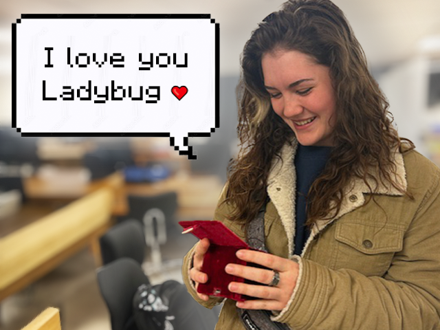
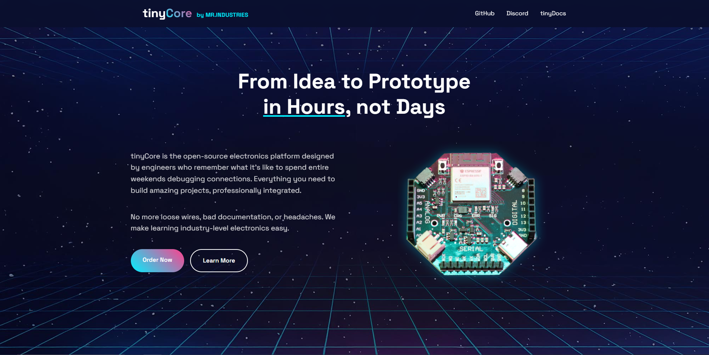
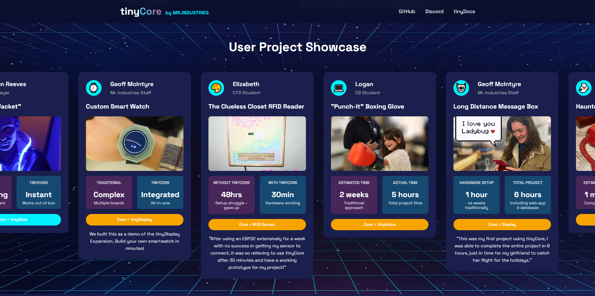
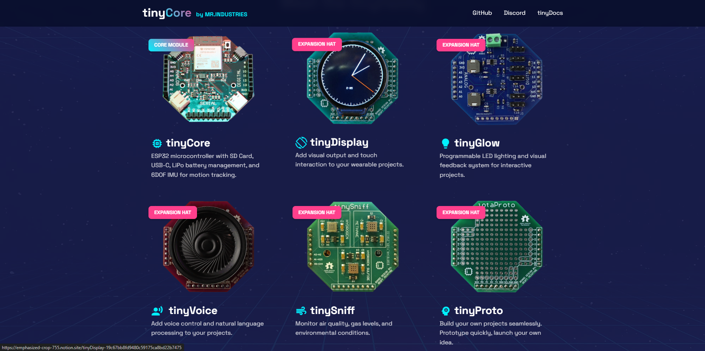
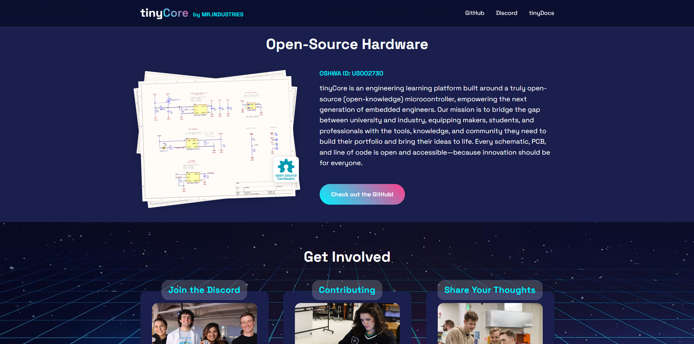
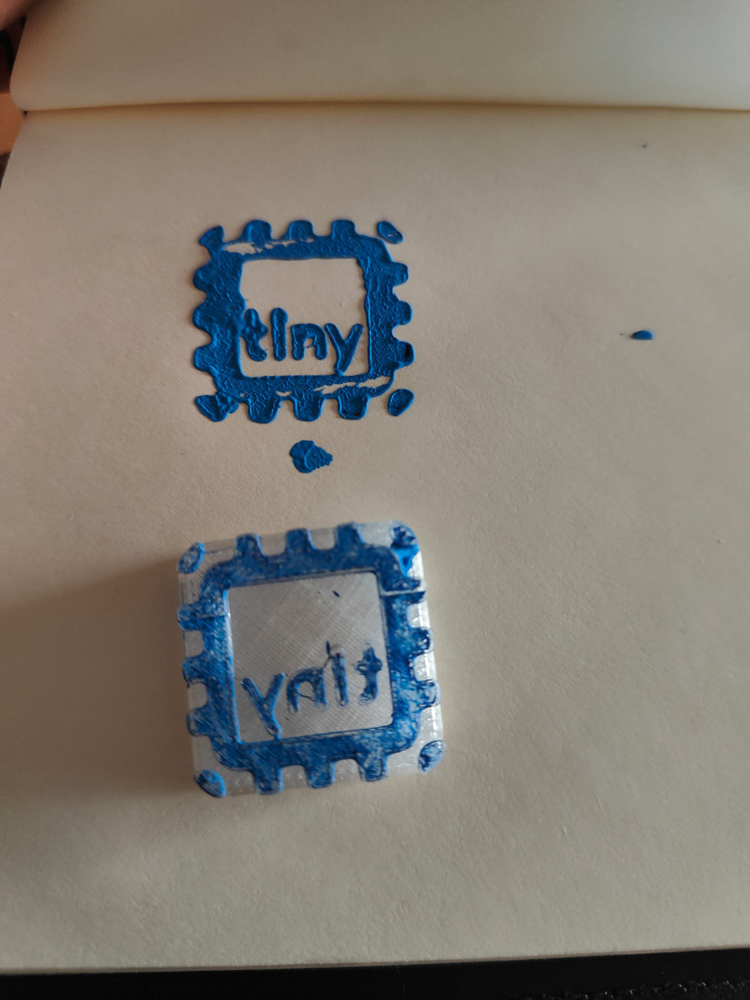

Here's what's happened at Mr. Industries in the last few weeks:

- Finalized our testing procedures and began soldering and testing units 
- Listed our product on Tindie!
- Posted two tinyCore projects on Instructables
- Won the Wearables Instructables contest!
- Gave the website a facelift
- Designed our super secret online coding agent
- Onboarded a Software Engineer :)

Also I'm in Ireland...

<!-- more -->

---

### Production & Fulfillment

Testing is coming along swimmingly. We now offer pre-soldered boards on our store!

Speaking of store, we're now selling tinyCores on Tindie. **Check out our cool new button:**

### Community & Marketing

We've been busy posting Instructables to raise some awareness for the project. So far we've got two published:

  - 
    
    /// caption
    [OpenHEG: Inspiring Kids to Learn About Their Brains!](https://www.instructables.com/Inspiring-Kids-to-Learn-About-Neuroscience-How-I-M/)
    ///

  - 
    
    /// caption
    [How to Build a Long Distance Message Box](https://www.instructables.com/-How-to-Make-a-Long-Distance-Message-Box-/)
    ///

OpenHEG actually won Runner-Up in the [Wearables Contest](https://www.instructables.com/contest/makeitwearable2025/#entries), and we'll be using the prize money to build more cool tinyCore projects!

We also gave the website a total overhaul!

### Events & Opportunities

Boulder Startup Week proved to be very valuable for networking and connections. We're now working with the Boulder Public Library to offer a tinyCore course!

Open Sauce is rapidly approaching, and we're getting the booth ready. 

This year, we'll be joining the Stamp Hunt! Check out our stamp:

  - 
    
    /// caption
    No ink, no problem (Just use paint!)
    ///

  - 
    
    

Aiden's mom is making us custom shirts (Moms are the best!) How's that for bootstrapping?

We're also making all kinds of loot for people to find if they visit our booth.

### What's Next

Right now, Open Sauce is rapidly approaching and we are ***hustling*** to get prepared. Weeknotes have been sparse as we work on a lot of behind-the-scenes improvements and business development.

---

**As always, we'd love your feedback, and we've made it easier than ever to contribute! Drop us a comment below with your thoughts, projects, or questions!**

