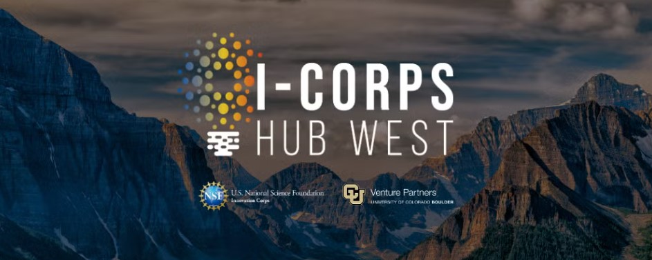
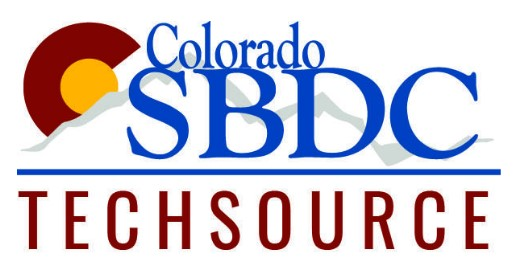
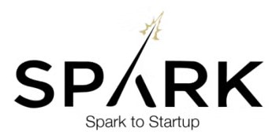
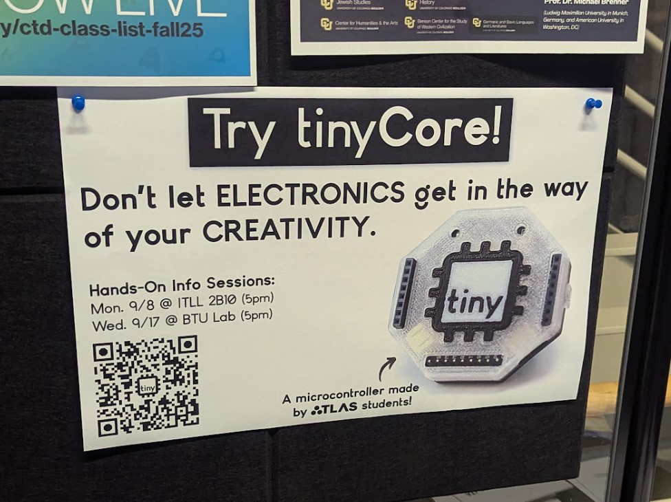
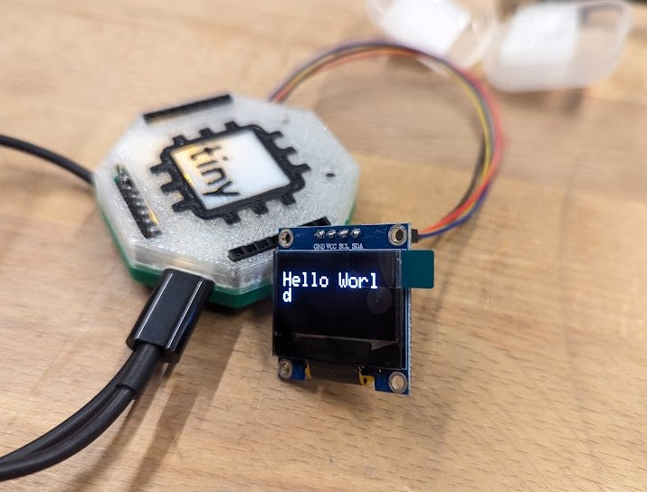
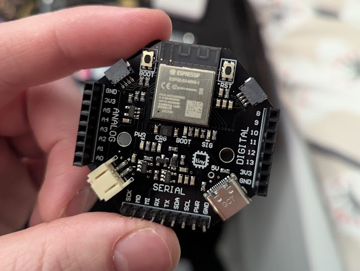
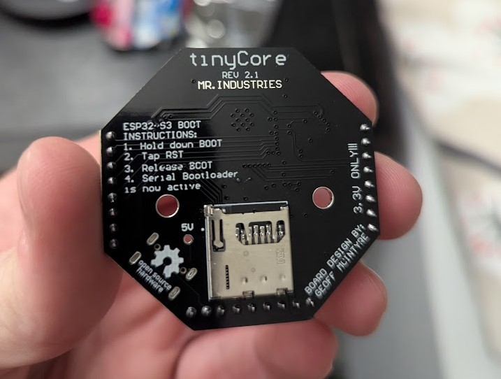
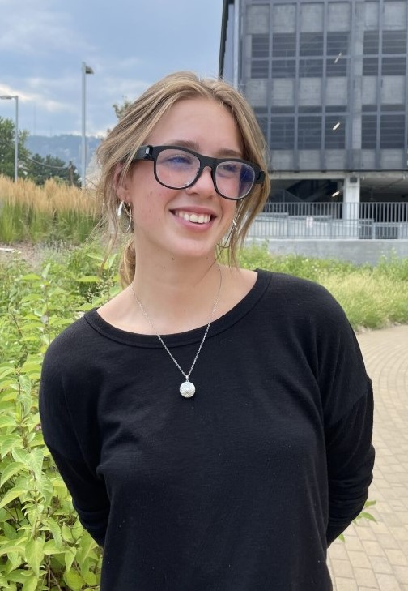
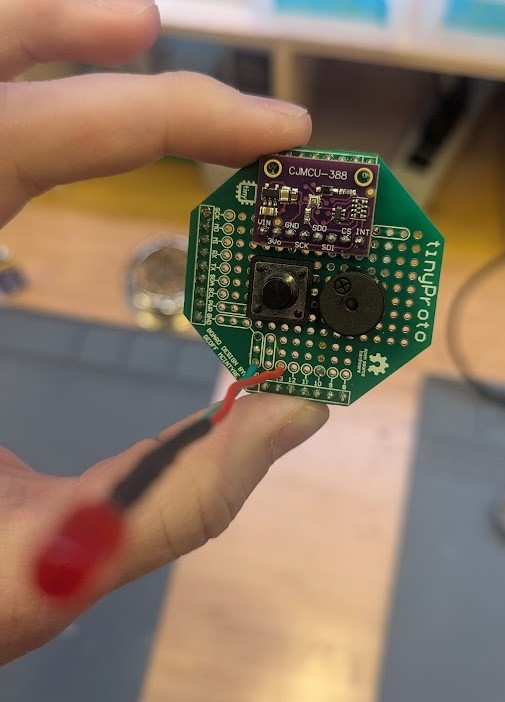
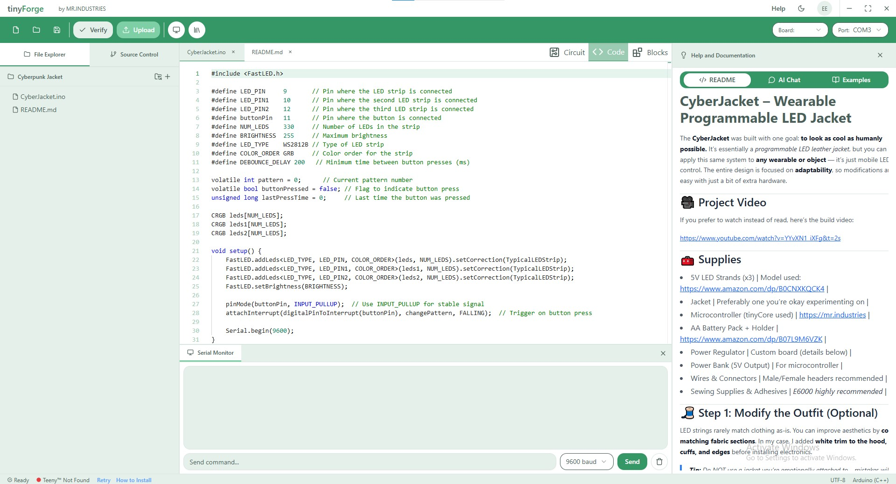

I've finally emerged from monk mode after locking in to ~~beat Silksong~~ *pass my final semester* to provide you with updates! Contrary to popular belief, I did not get hit by a truck. (Actually our co-founder did, but she's doing okay now.) Over the past few months, we've been doing a lot of work behind the scenes, which has made it hard to write consistent public updates, but now we're able to share!

## 🔥 Highlights
- Sold 100 tinyCore kits!
- Piloting the board in 4 classes at CU
- Finished our first contract with a startup to prototype their product with tinyCore
- Finished the NSF I-Corps 3-week accelerator program
- Got accepted into 2 more accelerators: Spark CU and Techsource Venture Accelerator (TVX)
- Bought a new domain: ***tinycore.cc***

----------

### Accelerators

In August, we completed NSF I-Corps training, which included 20+ customer interviews and helped us re-focus on how we define our customer segements. And after finishing that 3-week intensive, we've also been accepted into two more incredible startup accelerators:

**Spark CU and Techsource Venture Accelerator (TVX)!** Both programs have already helped us refine our pitch and marketing strategy, meet mentors, and prepare for funding. 

  - 
  - 

### Campus Traction at CU

This semester has been especially successful with regards to our pilot program at CU. We currently have four courses on campus that endorse tinyCore for their hardware kit options, and have sold 13 units to professors. We've also taught 2 "Intro to tinyCore" classes in the ITLL and BTU Lab makerspaces. It was great to see what students made in under an hour!

Here's a Hello-World demo running on an OLED that was made by a student during one of these demos:

And students have already begun using tinyCore in their projects, which we will highlight more later in the semester. I've already seen a giant fishing reel game controller, some wearable devices, and I'm really excited to share them soon.

### Sales Milestone
We have just hit 100 kits sold, and shipped our first international order! It did require developing some new processes and lots of learning (turns out UPS and USPS labels are easy to mix-up when you're sorting packages).

We almost ran out of tinyCores, but another shipment just arrived so we've got a fresh new batch sporting a useful, much-requested feature: an accessible 5V pin! This will be extremely helpful once we start shipping our smart LED hats, which require 5V input.

  
  - 
  - 
  

### Startup Partnerships and Community Projects

I'm also excited to announce our first partnership with a startup called Hapware to help them prototype their smart glasses for the visually impared. They contracted the tinyCore team to develop one of their demo units, and it was a fun experience! You can learn more about their awesome venture [here](https://hapware.com/).

  - 
  - 

We're also launching a partnership program for professors on campus to work with the tinyCore team to develop their own tinyHATs, and we've got our first partner, which we are working on an EKG hat for. I can't reveal more just yet, but I'm excited to share soon.

Lastly, I wanted to do a community shoutout to Vince (@stelle_space), a student founder building a model rocket telemetry device called FROG avionics, which uses tinyCore! Vince has developed his own custom tinyHAT that fits nicely inside his rockets, and he even sky-dived with the tinyCore to test out the accuracy. You can follow his project [here](https://www.instagram.com/stelle_space/).

  - 
  - 

### tinyForge

Our browser-based coding and circuit design tool, tinyForge, is almost ready for beta. We've begun the final integrations of the Arduino CLI and USB Serial communications into the software. I'm very excited for users to get their hands on it. We're aiming for a beta release before the end of the year. Early adopters will get priority access to this, and lifetime access as a thank-you for supporting the project!

### New Domain Who Dis?

I've talked with a hundred customers at this point and watched how people find our site, and.. it's rough. Most people don't know that .industries is a top-level domain (like .com), and so I've watched many times as people type in "mr.industries.com" and come up with a broken site. Not to mention Google doesn't understand tinyCore SEO at all.

To help with this, I've purchased two new domains, which we will slowly transition to become the official domains of the tinyCore project: **tinycore.cc** and **tinycore.net**. Hopefully this will help lead more users to the site (we've already seen an uptick in analytics since doing this) and make it easier to google search. (And maybe someday we can afford to buy tinycore.com!)

Right now, both addresses redirect to mr.industries, but eventually we’ll flip that so mr.industries points to tinycore.cc instead. There may be some brief downtime while we sort out DNS, so if the site is down for a bit, don’t worry, it’ll be back up shortly!

If you share the project, please start using: https://tinycore.cc or https://tinycore.net

### What's Next

- Finishing the tinyForge Beta

- Finalizing our Kickstarter campaign

- Publishing curriculum resources

- Continuing our work with accelerators

- Shipping more kits and growing the community

Thanks for sticking with us during monk mode. We're back.
