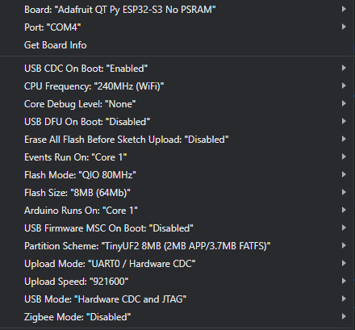

Had some issues with Serial Monitor not working, and the device not being recognized, it was confusing to get down, but I solved those issues.

1. ERR light turns on during operation
    
    Apparently this is normal, ERR LED is connected to GPIO21, which is the Debug pin on the ESP32-S3. This means that it pulls low when it's in debug, and defaults high in regular mode (although this can be overridden in code [TESTED]).
    
<!-- more -->

    On our next revision, we should pull this pin active low, so that it turns on to signify bootloader mode. Speaking of bootloader mode... 
    
2. Board not recognized (not in Boot Mode)
    
    To get into Boot Mode, you have to hold down the BOOT button, press the RESET button momentarily (While still holding down BOOT), and then release the BOOT button.
    
    On Rev. 1 the ERR light will turn off if you did this successfully. 
    
    This may change the COM Port! Be sure to check in the IDE before flashing.
    
3. Serial Monitor not working
    
    There are a bunch of weird flash settings on Arduino that do not initialize correctly when you choose the board, and sometimes they reset when you open up the IDE after closing. 
    
    To fix this, make sure that these are your settings:
    
    
    
    The big ones are 
    
    - Upload Mode: "UART0 / Hardware CDC"
    - USB Mode: "Hardware CDC and JTAG"
    - USB CDC On Boot: "Enabled"
    
    This should fix the errors with serial monitor.
    

Board works and boots using **Adafruit ESP32-S3 No PSRAM** Board.

Needs to have it's own Arduino Board file developed.