<aside>
This post was made in Discord on 1/24/25
</aside>

Hey guys! I'll be trying to post periodic/bi-weekly updates on development more frequently in these channels. Here's what happened in the last two weeks.
We are rapidly developing the tinyCore as the first element of our project. Revision 2 has been created, with some minor circuit modifications and bug fixes. We've ordered 20 of this board, on 1/14, and we expect the boards to arrive prior to 2/22.

<!-- more -->

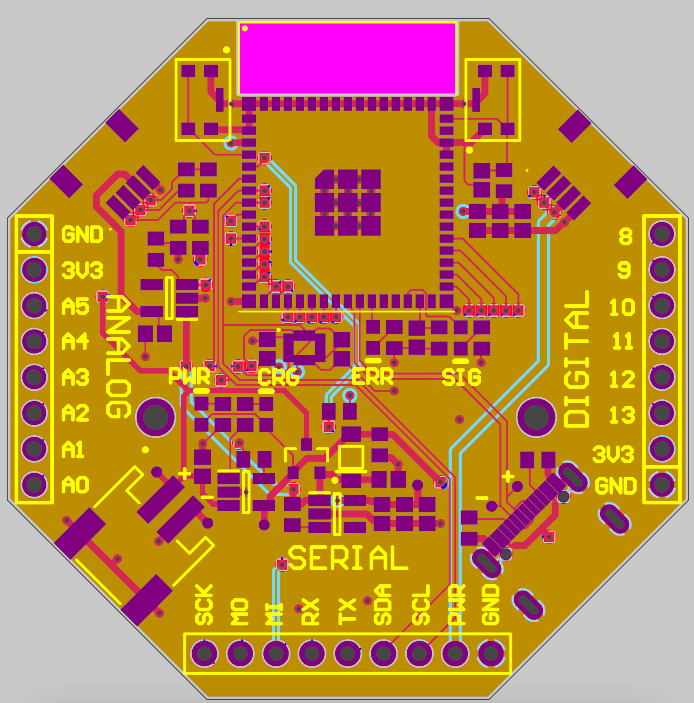

Revision 1.0

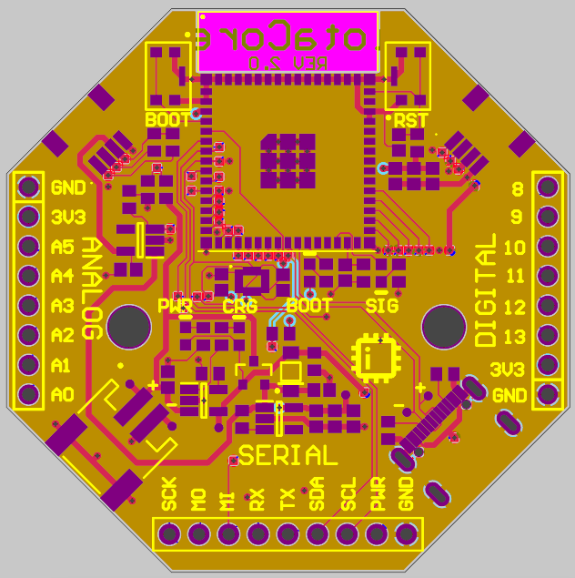

Revision 2.0

**PCB Revision Notes:**

As you can see from the two revisions, we have made several changes:

1. Rerouted Power lines to avoid cross-unders and improve noise
2. Completely overhauled the backside silkscreen with useful information and icons
3. Labeled the front buttons 
4. Renamed ERR Led to BOOT, and made active high, so now it will turn on when the user has the board in bootloader mode. (This status is one of my biggest complaints with ESP32 boards)
5. Made the mounting holes larger (from 1.5mm to M3 screws) and moved components for headroom
6. Added Ground Vias next to digital signal lines to decrease noise

Things we chose not to change (yet):

1. PCB Cutout underneath antenna.
    1. We found no significant issue with performance having the PCB as-is during our wireless speed-tests. We will continue to investigate but it currently seems unnecessary for our applications.
2. Move Buttons away from PCB Antenna
    1. Same thing here, the performance is fine, so we left them. (This was a tradeoff between size, form-factor, and performance. We chose size/form-factor.
3. Changing Headers to Sew-able Pads
    1. Although recommended by wearables users, we did not make this change because it would significantly change the design, and does not serve a great purpose for our intended form-factor (in an enclosure). We are working on a possible breakout board that would allow for better sew-ability of the device. 
4. Add Magnetometer (9-DOF Sensor Fusion)
    1. This would be really cool, but is outside our scope right now. Accelerometer is the most versatile motion measurement, and we believe it covers our current user-base. This may be added in the future, but at the moment it would only increase BOM complexity and costs, and would benefit only a few of our customers.
5. JTAG Pads Exposure on PCB Backside
    1. We did not add this since the ESP32-S3 already has JTAG-over-USB capabilities built in. Although it would be nice for mass manufacturing/firmware writing with bed-of-nails, it is out of scope for this revision.
6. Better Buttons
    1. We're still using the old mushy buttons for now. Might fix at some point but this has been backlogged.

**Silkscreen Updates:**

Our first silkscreen SUCKED. Mostly because it doesn't have one. Here's a comparison side-by-side of the revisions:

**Front:**

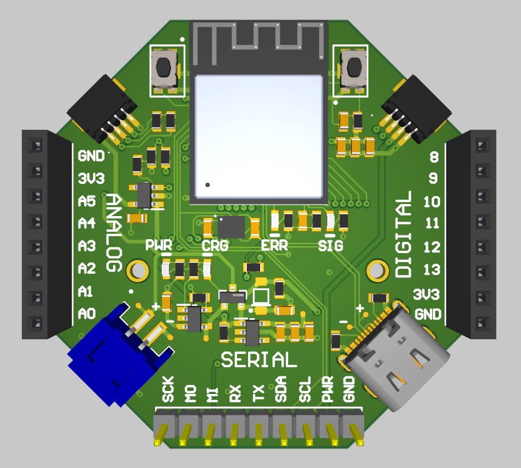

(Old)

**Back:**

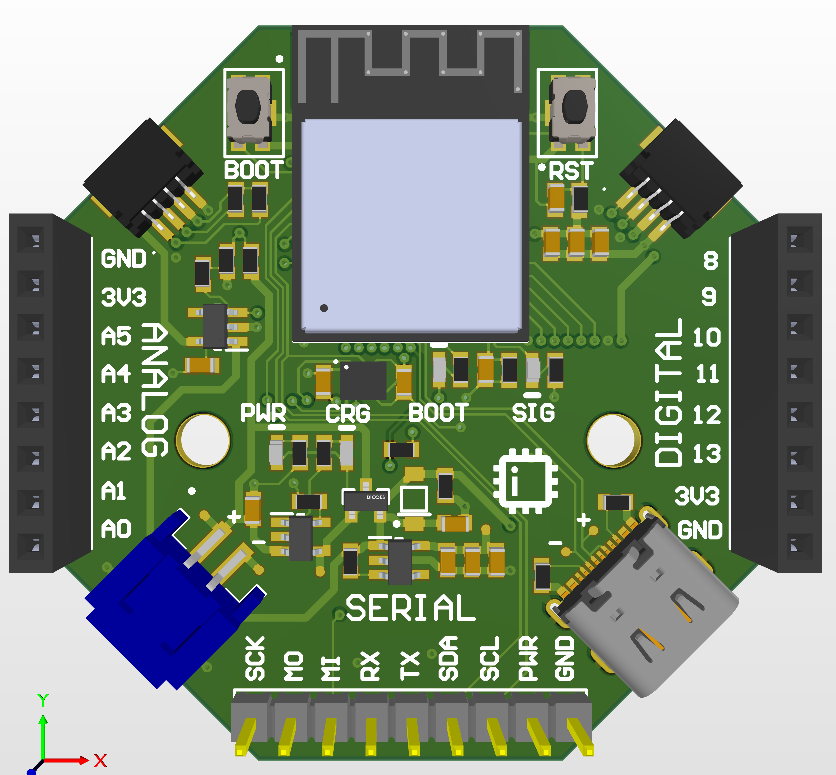

(New)

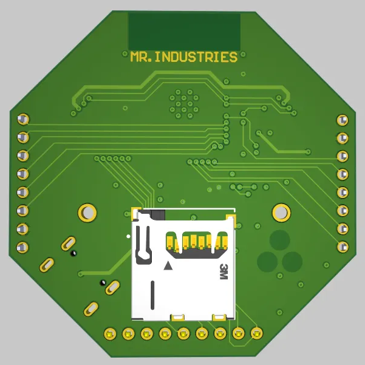

(Old)

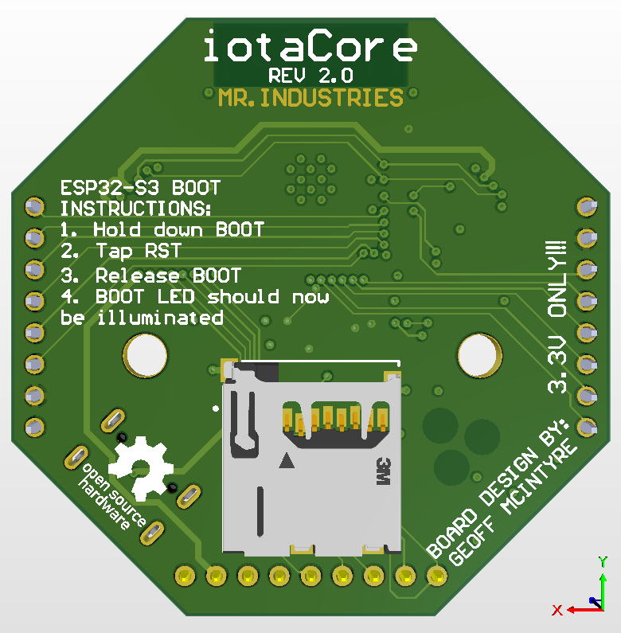

(New)

As you can see, we've added a ton of new icons, logos, labels, etc. And most importantly, we've added the bootloader instructions for the ESP32-S3. (No more googling because you forgot the button sequences.)

**Enclosure Prototypes**

Lastly for our updates this week, we have been hard at work designing 3D Printable enclosures for the iotaCore. So far we've got a few different colors and options. All of these were printed on the Bambu X1 Carbon with multi-colors:

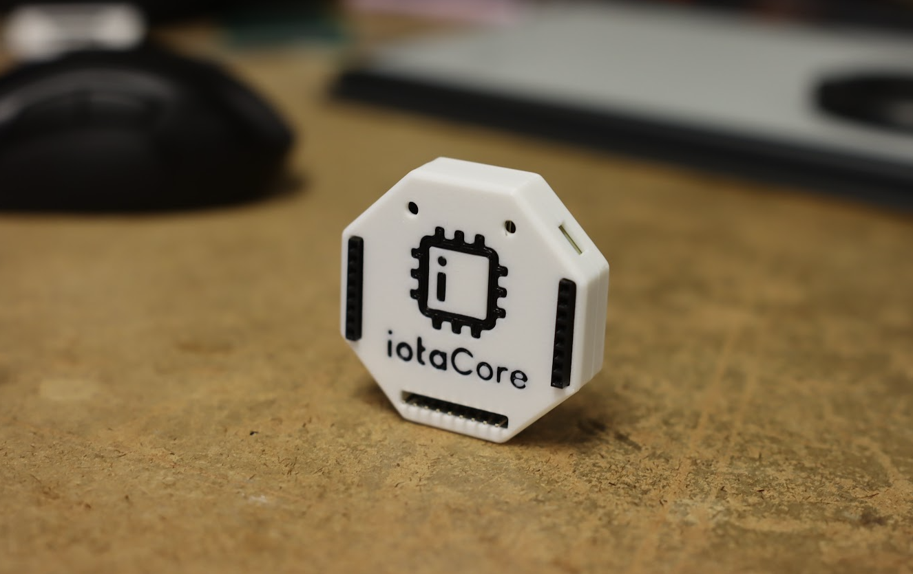

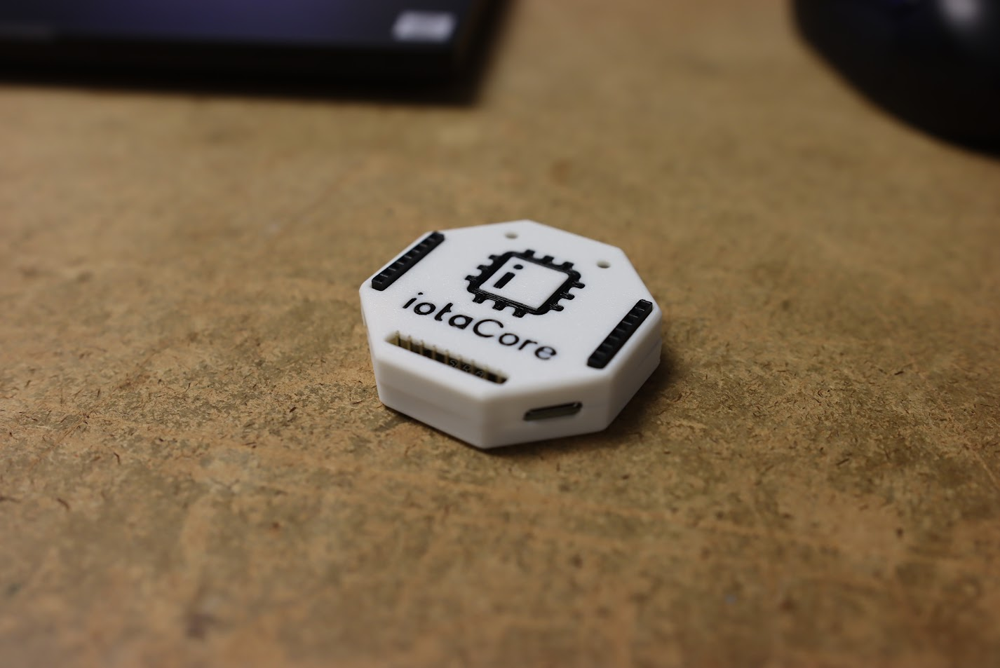

Here's a few different versions of transparent cases:

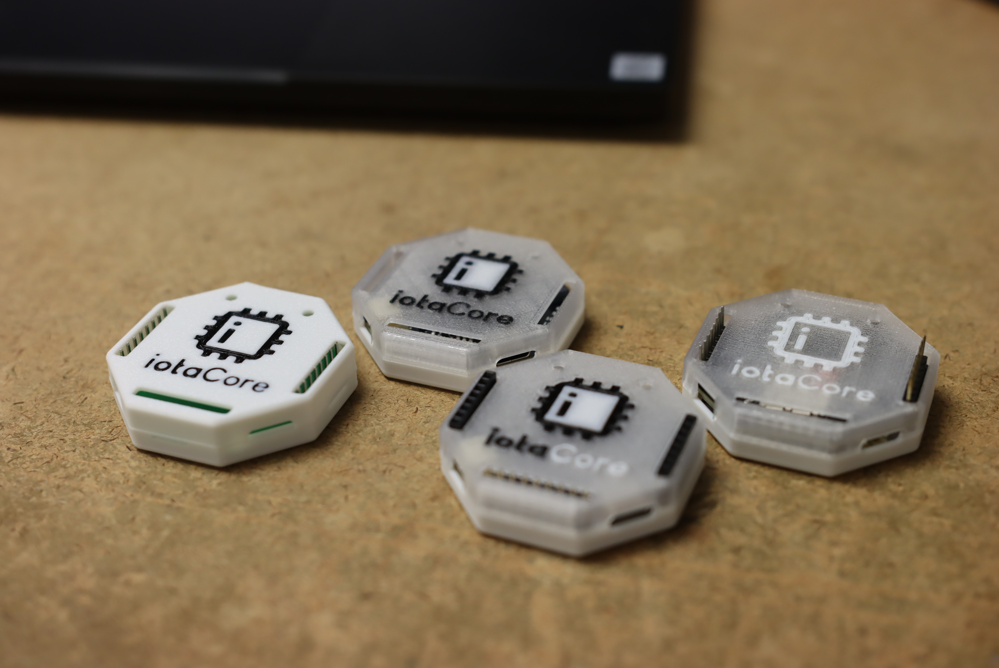

And it can stack! (More on this soon)

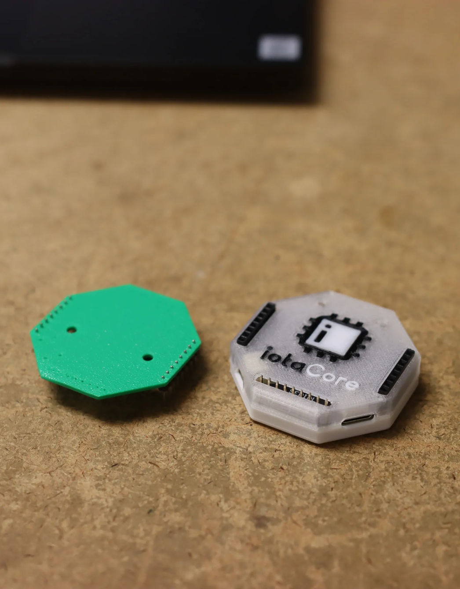

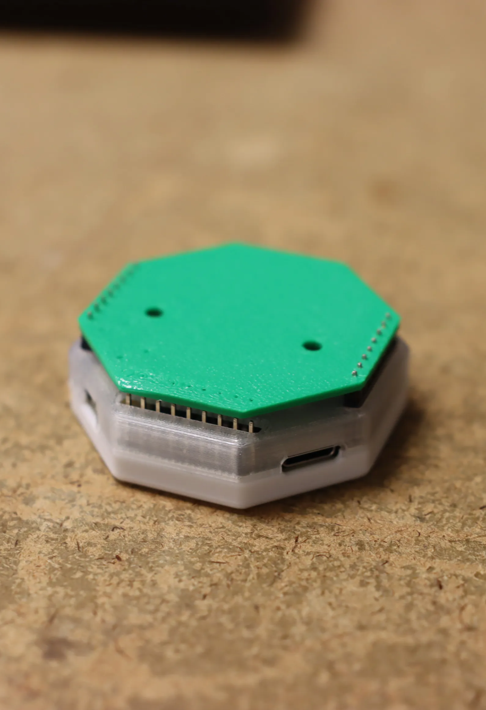

Things we still need to revise with the enclosures:

1. Improve tolerances
2. Add Heat-insets
3. Add SD Card accessibility
4. Add Screw Terminal version
5. Experiment with other colors and using clear filament for light-pipes.
6. Finish adding Buttons (TPU?)

That's about it for this week! We've been experimenting with some expansion module prototypes for the tinyVoice and tinyDisplay as well, so we should have some updates on that soon!