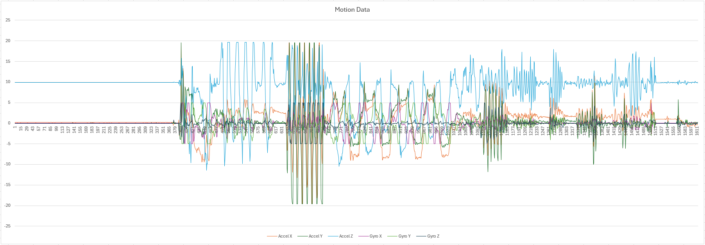

Finally got the SD Card working! Turns out the CS Pin is connected to GPIO1, not GPIO2, due to a pin mix-up in the library. Simple software fix, and it's like magic!

Also, I would recommend verifying that you don't have a corrupted Chinese-knockoff SD Card, as this will also cause you headaches and make things more difficult to solve.

For the SD test, we actually used the Arduino SD_Test Example, which worked out of the box (with our custom board library):
<!-- more -->

```cpp
void listDir(fs::FS &fs, const char *dirname, uint8_t levels) {
  Serial.printf("Listing directory: %s\n", dirname);

  File root = fs.open(dirname);
  if (!root) {
    Serial.println("Failed to open directory");
    return;
  }
  if (!root.isDirectory()) {
    Serial.println("Not a directory");
    return;
  }

  File file = root.openNextFile();
  while (file) {
    if (file.isDirectory()) {
      Serial.print("  DIR : ");
      Serial.println(file.name());
      if (levels) {
        listDir(fs, file.path(), levels - 1);
      }
    } else {
      Serial.print("  FILE: ");
      Serial.print(file.name());
      Serial.print("  SIZE: ");
      Serial.println(file.size());
    }
    file = root.openNextFile();
  }
}

void createDir(fs::FS &fs, const char *path) {
  Serial.printf("Creating Dir: %s\n", path);
  if (fs.mkdir(path)) {
    Serial.println("Dir created");
  } else {
    Serial.println("mkdir failed");
  }
}

void removeDir(fs::FS &fs, const char *path) {
  Serial.printf("Removing Dir: %s\n", path);
  if (fs.rmdir(path)) {
    Serial.println("Dir removed");
  } else {
    Serial.println("rmdir failed");
  }
}

void readFile(fs::FS &fs, const char *path) {
  Serial.printf("Reading file: %s\n", path);

  File file = fs.open(path);
  if (!file) {
    Serial.println("Failed to open file for reading");
    return;
  }

  Serial.print("Read from file: ");
  while (file.available()) {
    Serial.write(file.read());
  }
  file.close();
}

void writeFile(fs::FS &fs, const char *path, const char *message) {
  Serial.printf("Writing file: %s\n", path);

  File file = fs.open(path, FILE_WRITE);
  if (!file) {
    Serial.println("Failed to open file for writing");
    return;
  }
  if (file.print(message)) {
    Serial.println("File written");
  } else {
    Serial.println("Write failed");
  }
  file.close();
}

void appendFile(fs::FS &fs, const char *path, const char *message) {
  Serial.printf("Appending to file: %s\n", path);

  File file = fs.open(path, FILE_APPEND);
  if (!file) {
    Serial.println("Failed to open file for appending");
    return;
  }
  if (file.print(message)) {
    Serial.println("Message appended");
  } else {
    Serial.println("Append failed");
  }
  file.close();
}

void renameFile(fs::FS &fs, const char *path1, const char *path2) {
  Serial.printf("Renaming file %s to %s\n", path1, path2);
  if (fs.rename(path1, path2)) {
    Serial.println("File renamed");
  } else {
    Serial.println("Rename failed");
  }
}

void deleteFile(fs::FS &fs, const char *path) {
  Serial.printf("Deleting file: %s\n", path);
  if (fs.remove(path)) {
    Serial.println("File deleted");
  } else {
    Serial.println("Delete failed");
  }
}

void testFileIO(fs::FS &fs, const char *path) {
  File file = fs.open(path);
  static uint8_t buf[512];
  size_t len = 0;
  uint32_t start = millis();
  uint32_t end = start;
  if (file) {
    len = file.size();
    size_t flen = len;
    start = millis();
    while (len) {
      size_t toRead = len;
      if (toRead > 512) {
        toRead = 512;
      }
      file.read(buf, toRead);
      len -= toRead;
    }
    end = millis() - start;
    Serial.printf("%u bytes read for %lu ms\n", flen, end);
    file.close();
  } else {
    Serial.println("Failed to open file for reading");
  }

  file = fs.open(path, FILE_WRITE);
  if (!file) {
    Serial.println("Failed to open file for writing");
    return;
  }

  size_t i;
  start = millis();
  for (i = 0; i < 2048; i++) {
    file.write(buf, 512);
  }
  end = millis() - start;
  Serial.printf("%u bytes written for %lu ms\n", 2048 * 512, end);
  file.close();
}

void setup() {
  Serial.begin(115200);
  while (!Serial) {
    delay(10);
  }

#ifdef REASSIGN_PINS
  SPI.begin(sck, miso, mosi, cs);
  if (!SD.begin(cs)) {
#else
  if (!SD.begin()) {
#endif
    Serial.println("Card Mount Failed");
    return;
  }
  uint8_t cardType = SD.cardType();

  if (cardType == CARD_NONE) {
    Serial.println("No SD card attached");
    return;
  }

  Serial.print("SD Card Type: ");
  if (cardType == CARD_MMC) {
    Serial.println("MMC");
  } else if (cardType == CARD_SD) {
    Serial.println("SDSC");
  } else if (cardType == CARD_SDHC) {
    Serial.println("SDHC");
  } else {
    Serial.println("UNKNOWN");
  }

  uint64_t cardSize = SD.cardSize() / (1024 * 1024);
  Serial.printf("SD Card Size: %lluMB\n", cardSize);

  listDir(SD, "/", 0);
  createDir(SD, "/mydir");
  listDir(SD, "/", 0);
  removeDir(SD, "/mydir");
  listDir(SD, "/", 2);
  writeFile(SD, "/hello.txt", "Hello ");
  appendFile(SD, "/hello.txt", "World!\n");
  readFile(SD, "/hello.txt");
  deleteFile(SD, "/foo.txt");
  renameFile(SD, "/hello.txt", "/foo.txt");
  readFile(SD, "/foo.txt");
  testFileIO(SD, "/test.txt");
  Serial.printf("Total space: %lluMB\n", SD.totalBytes() / (1024 * 1024));
  Serial.printf("Used space: %lluMB\n", SD.usedBytes() / (1024 * 1024));
}

void loop() {}

```

I then updated this with the IMU code, and created a basic motion datalogger device:

```cpp
#include <Adafruit_LSM6DS3TRC.h>
#include "FS.h"
#include "SD.h"
#include "SPI.h"

Adafruit_LSM6DS3TRC lsm6ds3trc;
File dataFile;
const char* DATA_FILENAME = "/imu_data.txt";
unsigned long lastLogTime = 0;
const unsigned long LOG_INTERVAL = 25; // Log every 25ms

void setup() {
  Serial.begin(115200);
  while (!Serial) {
    delay(10);
  }
  
  // Initialize I2C
  Wire.begin();
  delay(100);

  // Initialize SD card
  if (!SD.begin()) {
    Serial.println("Card Mount Failed");
    return;
  }

  uint8_t cardType = SD.cardType();
  if (cardType == CARD_NONE) {
    Serial.println("No SD card attached");
    return;
  }

  Serial.print("SD Card Type: ");
  if (cardType == CARD_MMC) {
    Serial.println("MMC");
  } else if (cardType == CARD_SD) {
    Serial.println("SDSC");
  } else if (cardType == CARD_SDHC) {
    Serial.println("SDHC");
  } else {
    Serial.println("UNKNOWN");
  }

  // Initialize LSM6DS3TR-C
  Serial.println("Initializing LSM6DS3TR-C...");
  if (!lsm6ds3trc.begin_I2C()) {
    Serial.println("Failed to find LSM6DS3TR-C chip");
    while (1) {
      delay(10);
    }
  }
  Serial.println("LSM6DS3TR-C Found!");

  // Configure IMU settings
  lsm6ds3trc.setAccelRange(LSM6DS_ACCEL_RANGE_2_G);
  lsm6ds3trc.setGyroRange(LSM6DS_GYRO_RANGE_250_DPS);
  lsm6ds3trc.setAccelDataRate(LSM6DS_RATE_104_HZ);
  lsm6ds3trc.setGyroDataRate(LSM6DS_RATE_104_HZ);

  // Create/Open data file and write header
  dataFile = SD.open(DATA_FILENAME, FILE_WRITE);
  if (!dataFile) {
    Serial.println("Failed to open data file");
    return;
  }
  
  // Write CSV header
  dataFile.println("timestamp,temperature,accel_x,accel_y,accel_z,gyro_x,gyro_y,gyro_z");
  dataFile.flush();
  
  Serial.println("Logging started!");
  Serial.println("Format: timestamp,temperature,accel_x,accel_y,accel_z,gyro_x,gyro_y,gyro_z");
}

void logIMUData() {
  sensors_event_t accel;
  sensors_event_t gyro;
  sensors_event_t temp;
  lsm6ds3trc.getEvent(&accel, &gyro, &temp);
  
  // Format data string
  char dataString[100];
  snprintf(dataString, sizeof(dataString), 
           "%lu,%.2f,%.2f,%.2f,%.2f,%.2f,%.2f,%.2f",
           millis(),
           temp.temperature,
           accel.acceleration.x,
           accel.acceleration.y,
           accel.acceleration.z,
           gyro.gyro.x,
           gyro.gyro.y,
           gyro.gyro.z);
  
  // Write to SD card
  dataFile.println(dataString);
  dataFile.flush();  // Ensure data is written to card
  
  // Also print to Serial for monitoring
  Serial.println(dataString);
}

void loop() {
  unsigned long currentTime = millis();
  
  // Log data at specified interval
  if (currentTime - lastLogTime >= LOG_INTERVAL) {
    logIMUData();
    lastLogTime = currentTime;
  }
}
```

This program records movement data every 25ms and writes it to the SD Card. I tested opening the test file it creates in Excel as a CSV, and the results are fantastic:

| timestamp (ms) | temperature | accel_x | accel_y | accel_z | gyro_x | gyro_y | gyro_z |
| --- | --- | --- | --- | --- | --- | --- | --- |
| 940 | 24.98 | 0.17 | 0.05 | 9.86 | 0.03 | -0.06 | -0.05 |
| 964 | 24.97 | 0.19 | 0.06 | 9.85 | 0.03 | -0.06 | -0.05 |
| 989 | 24.97 | 0.21 | 0.07 | 9.85 | 0.03 | -0.06 | -0.05 |
| 1014 | 24.98 | 0.18 | 0.07 | 9.85 | 0.03 | -0.06 | -0.05 |
| 1039 | 24.98 | 0.2 | 0.06 | 9.85 | 0.03 | -0.06 | -0.05 |
| 1064 | 24.98 | 0.19 | 0.06 | 9.86 | 0.03 | -0.06 | -0.05 |
| 1089 | 24.98 | 0.17 | 0.07 | 9.85 | 0.03 | -0.06 | -0.05 |
| 1114 | 24.98 | 0.18 | 0.07 | 9.86 | 0.03 | -0.06 | -0.05 |
| 1139 | 24.98 | 0.2 | 0.07 | 9.86 | 0.03 | -0.06 | -0.05 |
| 1164 | 24.98 | 0.2 | 0.07 | 9.86 | 0.03 | -0.06 | -0.05 |
| ... | ... | ... | ... | ... | ... | ... | ... |

<aside>
Note that the Z axis is experiencing 9.81 m/s^2 of acceleration, which is due to gravity!
</aside>

