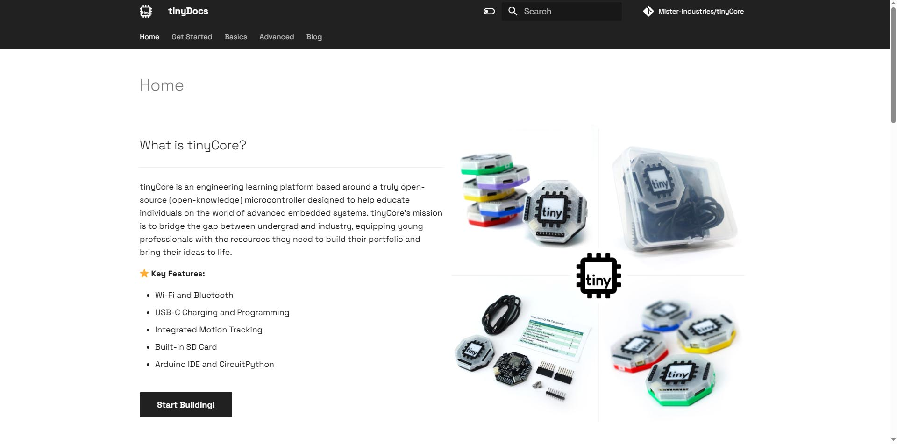
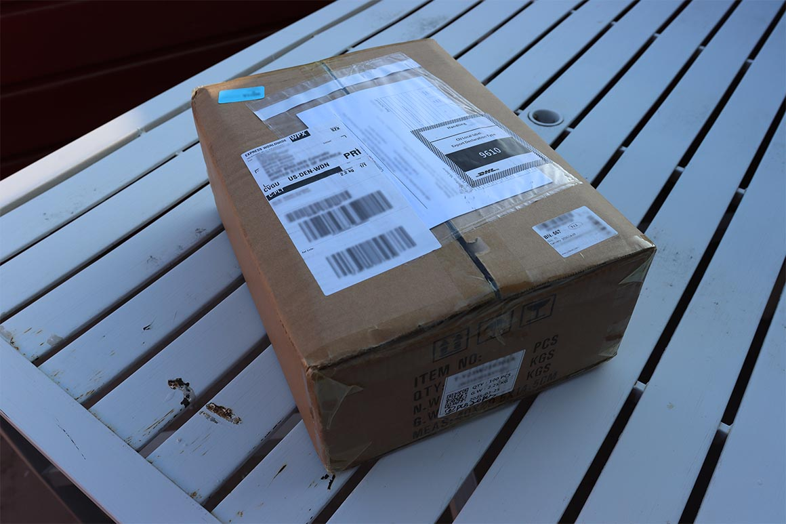
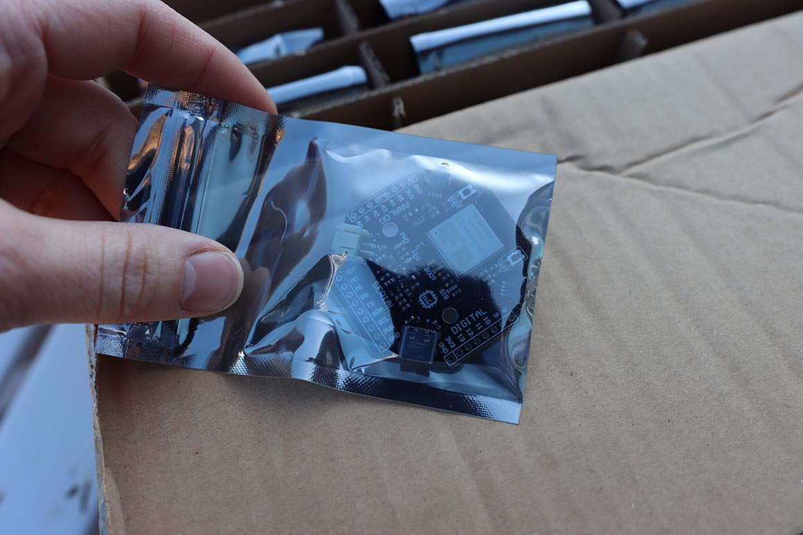
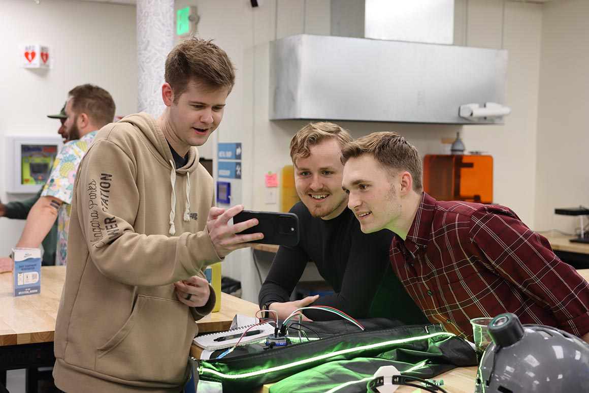
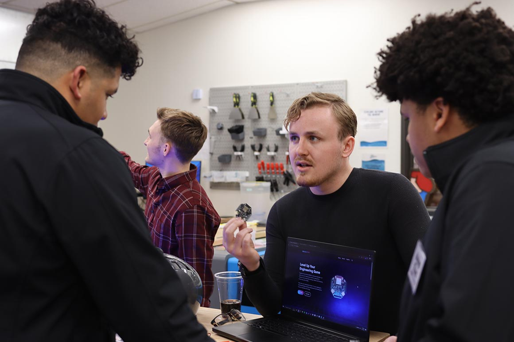
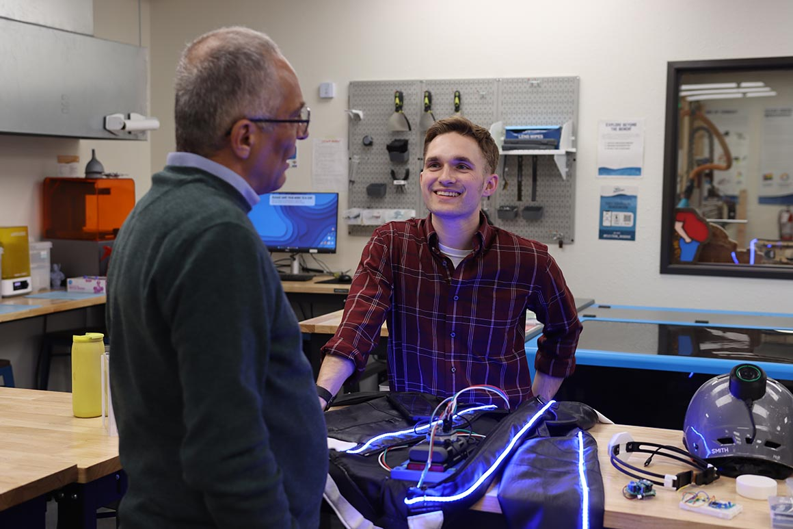
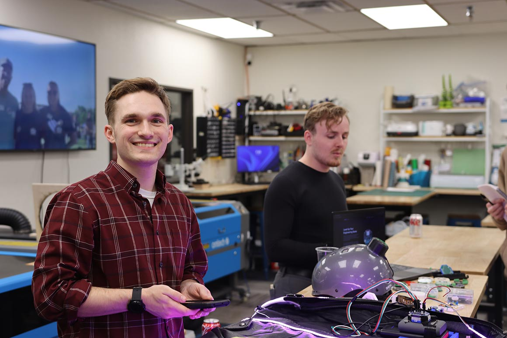
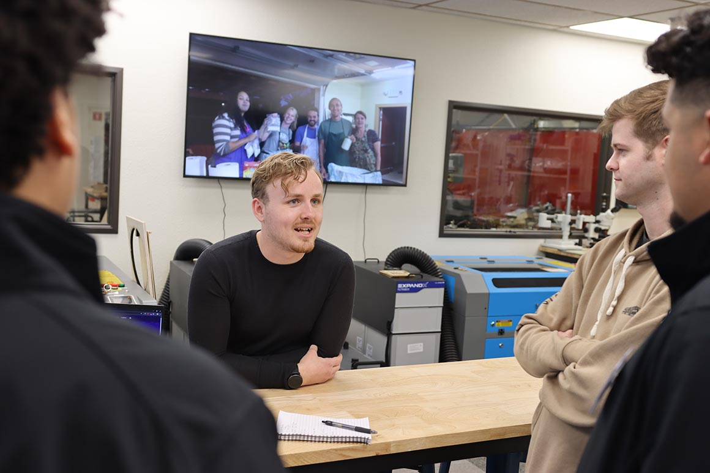

Hey everyone! Welcome to this week's Wednesday Weeknote. Here's what we've been up to:

## 🔥 Highlights

- Sexy new documentation website
- Presented at the 20th Anniversary Celebration for Clear Creek Makerspace
- Applied to the Underdogs Grant fund by MatrixOwl
- Hand-delivered a tinyCore V2 Starter Kit to a *certain* YouTuber :sunglasses:
- Our latest shipment of PCBs as arrived! (Next up: Testinggg)

<!-- more -->

---

### Hardware Updates

tinyCore is now officially OSHWA certified! Aside from getting access to a neat logo for our silkscreen, this also means our little board meets all of OSHWA's rigorous open-source hardware standards, certifying that everyone has the freedom to hack, modify, and build upon our design.

### Software & Documentation

As you can probably tell since you're reading this weeknote.. We have a new docs website (with a sexy new subdomain too)! 

This site will be the home for all of our new documentation and weeknotes moving forward. It's still under construction, but we will be working rapidly to fill out tutorials, datasheets, how-to's and more!

### Production & Fulfillment

Our first batch of new boards has arrived, and just in-time to miss some [fun changes](https://www.whitehouse.gov/presidential-actions/2025/04/regulating-imports-with-a-reciprocal-tariff-to-rectify-trade-practices-that-contribute-to-large-and-persistent-annual-united-states-goods-trade-deficits/) by our current administration. 

The boards look great. We've successfully powered-up and flashed the first unit, which is now ready to be shipped!

  - 

  - 

  - 

As the rest of our KoP[^1] makes it's way through lead-time, we're quickly beginning to ramp up our testing efforts with a custom rig, to standardize our procedures and process units rapidly. All of this will be documented in the open for learning purposes!

[^1]: Kit of Parts

### Community & Marketing

This week was the 20th Anniversary of LocalWorks, the managers of Clear Creek Makerspace. They extended us an invitation to present our project which we gratefully accepted! And the community really liked it! 

Here's some photos of our "booth" from the event. It was great to meet everyone, show off some of our student projects, and make the first irl debut of tinyCore!

  - 

  - 

  - 

  - 

  - 

### Events & Opportunities

If you'd like to meet us in-person, we've got several events coming up that we are scheduled to attend:

- Mines Entrepreneurship Summit - 4/16
- CU Boulder Engineering Expo - 4/25
- ATLAS Expo - 5/1

And we've currently applied to visit:

- Open Hardware Summit in Edinburgh- 5/30
- Open Sauce 2025- 7/18

We're also actively working on our submission to the Hackster.io Board Design Competition, and will update you shortly on progress.

### What's Next

- Testing, soldering, and more testing :star_struck:
- Fulfillment of our first pre-orders! 
- Continued development of our documentation

---

**We're trying a new style with the format of these weeknotes with MkDocs. As always, we'd love your feedback, and we've made it easier than ever to share! Drop us a comment below with your thoughts, projects, or questions!**

