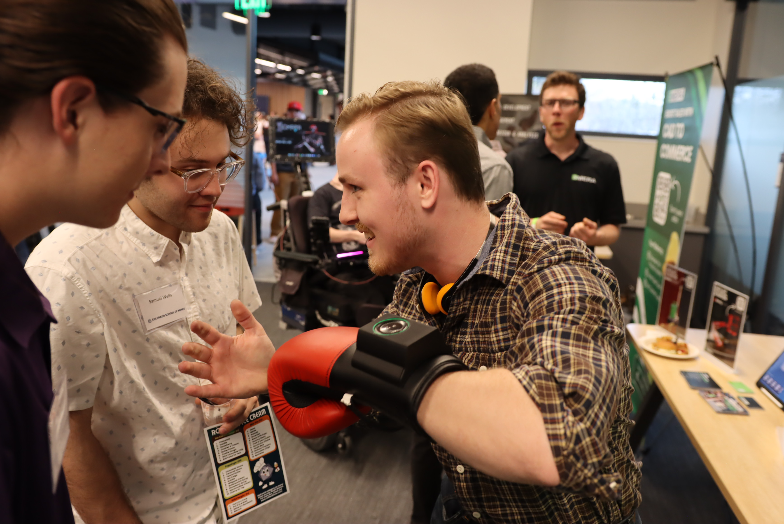
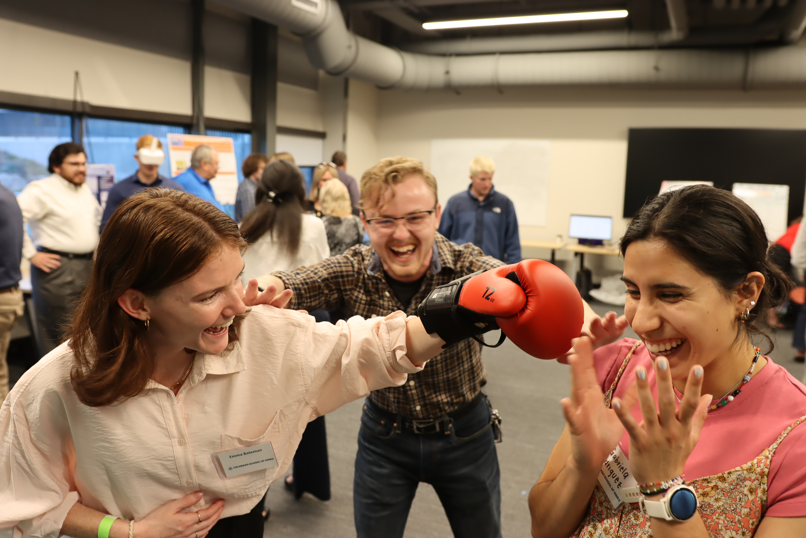
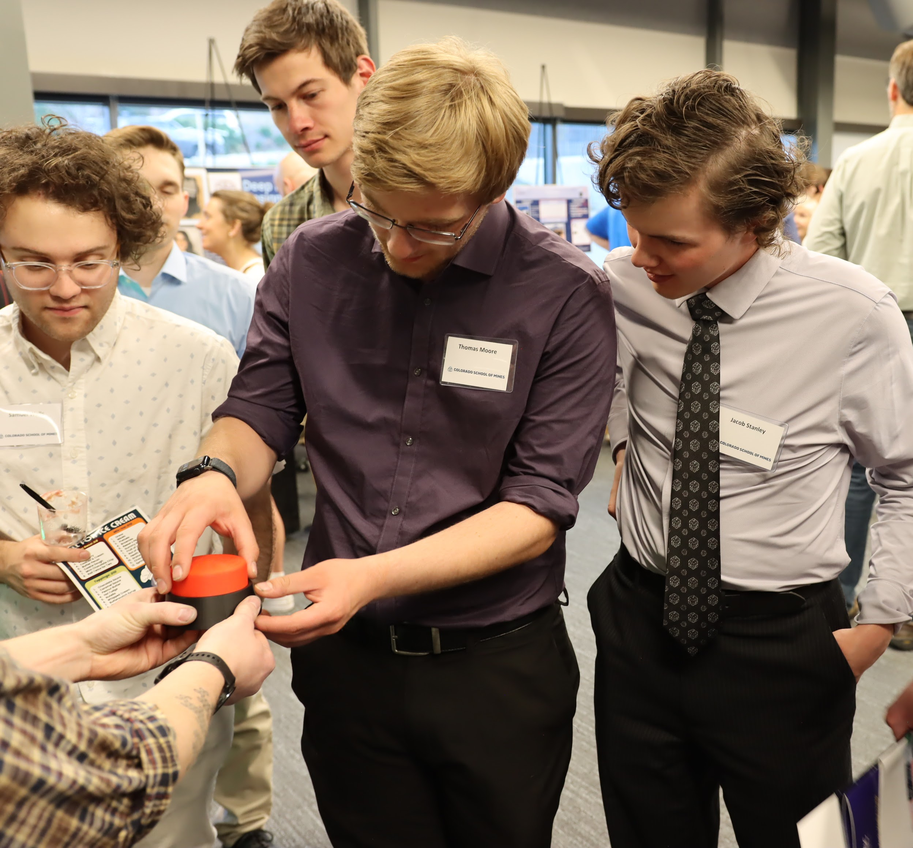
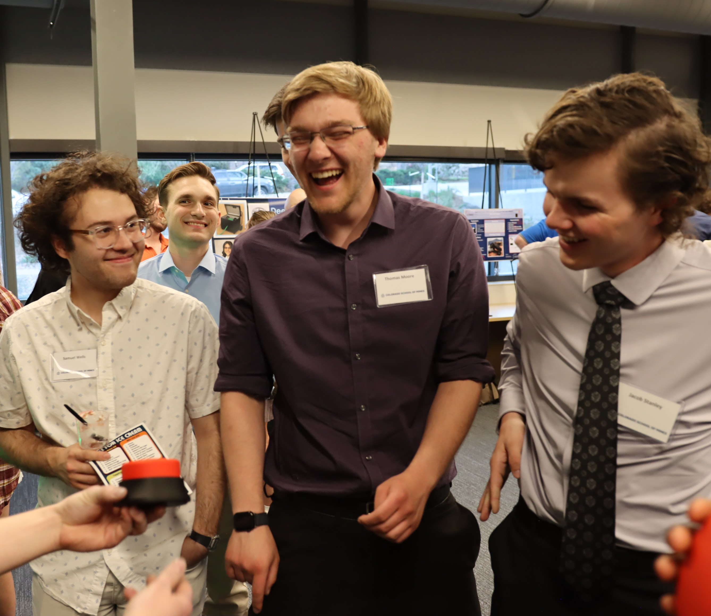
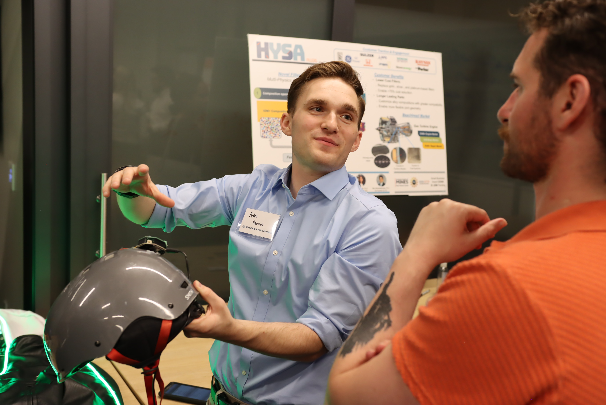
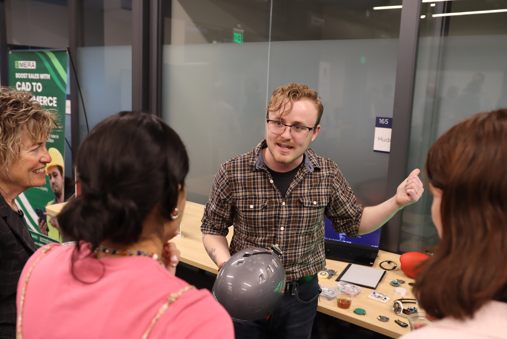
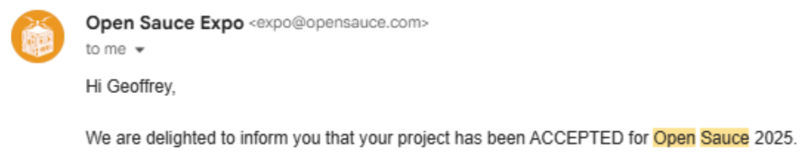
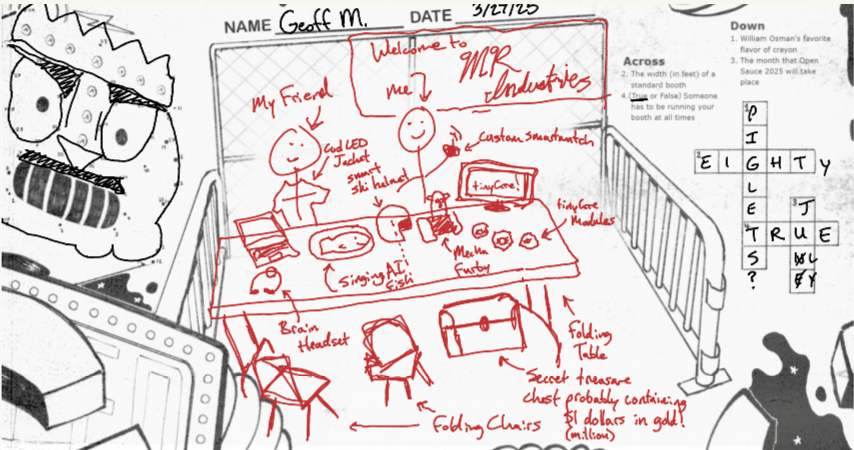

In the face of midterms and final projects, we continued to make
progress on tinyCore!
Here's what happened this week:

- Began testing V2.1 PCBs
- Attended First Pitch Colorado
- Met with more professors for our Fall Cohort
- Presented tinyCore at the Mines Entrepreneurship
- Showcase
- Shipped our first online orders
- GOT ACCEPTED FOR OPEN SAUCE!!

<!-- more -->

---

### Production & Fulfillment

This week we started testing our new V2.1 PCBs and started shipping pre-orders. Our first board was mailed just this past Wednesday! We’re actively developing our testing procedure, but here’s what we have so far:

```
1. Inspect Silkscreen for Quality and visual errors
2. Connect to PC via USB (It should be recognized as a generic ESP32 device, and will be connecting & disconnecting). 
3. PWR LED should be on, CHG LED should be flashing.
4. Plug in LiPo Battery, CHG goes solid.
5. Hold down BOOT, RST, BOOT sequence. Device will stop disconnecting.
6. Flash Blink Example (SIG LED should begin blinking)
7. 3V3 and PWR pins are >3.29V
8. Battery pins are >4.00V
9. Analog and Digital Pins should all be floating around the same value 10-50mV.
10. TX, SDA, SCL are all pulled high (>3.29V) by default
11. Device still runs on Battery Power once USB is removed.
```

We’d love your feedback on this procedure (comment thoughts below). To help with testing, Aiden is also actively designing a custom bed-of-nails testbench, powered by tinyCore of course!

### Community & Marketing

Aside from testing, we really focused on our marketing presence this week. We attended multiple networking events and I was overwhelmed by the amount of positive support and feedback we got from our in-person demos. We attended First Pitch Colorado, put on by Tim Morrisey, and presented at Mines Entrepreneurship Showcase --where we met with students, professors, and startup founders. There, we showed off all the cool projects students have built so far with tinyCore.

<div class="grid cards" markdown>

  - 
    
    /// caption
    The first exhibition of Punch-It! (Like Bop-It, but more violent)
    ///


  - 
    
    /// caption
    Followed by the SECOND exhibition of Punch-It!
    ///

</div>

/// caption
Made by Logan B. - Computer Science major, CU Boulder
///

<div class="grid cards" markdown>

  - 
    
    /// caption
    Users interacting with the student-made VINE BOOM button
    ///


  - 
    
    /// caption
    This one sparks joy
    ///

</div>

/// caption
Made by Elior B. - Mechanical Engineering major, Mines
///

<div class="grid cards" markdown>

  - 
    
    /// caption
    Aiden explains the Ski-Safe Alert Helmet 
    ///


  - 
    
    /// caption
    Geoff copies Aiden
    ///

</div>

/// caption
Made by Elizabeth S. - Creative Technology and Design major, CU Boulder
///

### Events & Opportunities

Oh yeah, and last but not least, this email ended up in our inbox…



So we’re OFFICIALLY PRESENTING AT OPEN SAUCE!!

We’re so excited. To celebrate, I thought I’d share our winning crayon-drawing entry (required by OS):


You can expect to see something like this at our booth in July! Although it’ll probably look a bit more realistic..


### What's Next

But we're not stopping here. We've got a lot more work to do
(aside from graduating), so it's time to get back to work. Here's
the agenda for next week:

1. Continue Testing and Kitting

2. Build out our core documentation (#KickassSupport)

3. Present our project at CU Senior Design Expo

4. Follow-up meetings with professors and founders from networking.


---

**As always, we'd love your feedback, and we've made it easier than ever to contribute! Drop us a comment below with your thoughts, projects, or questions!**

