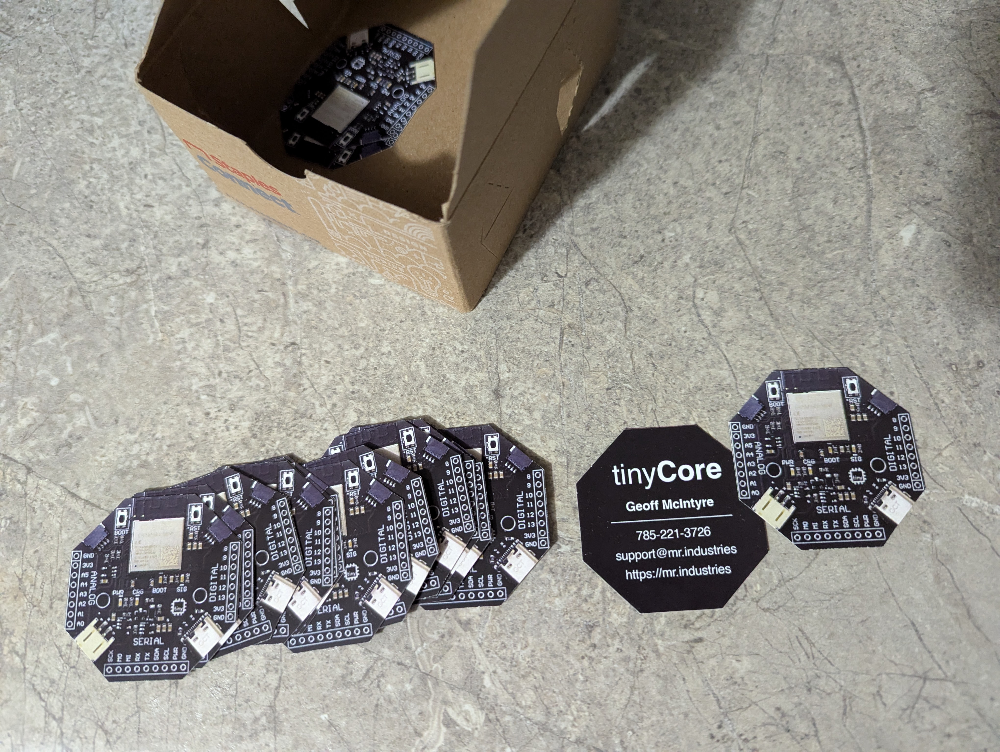
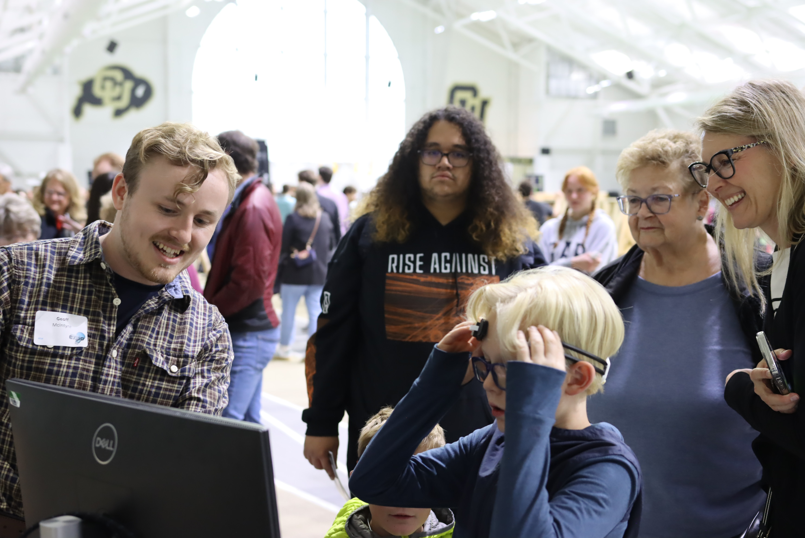
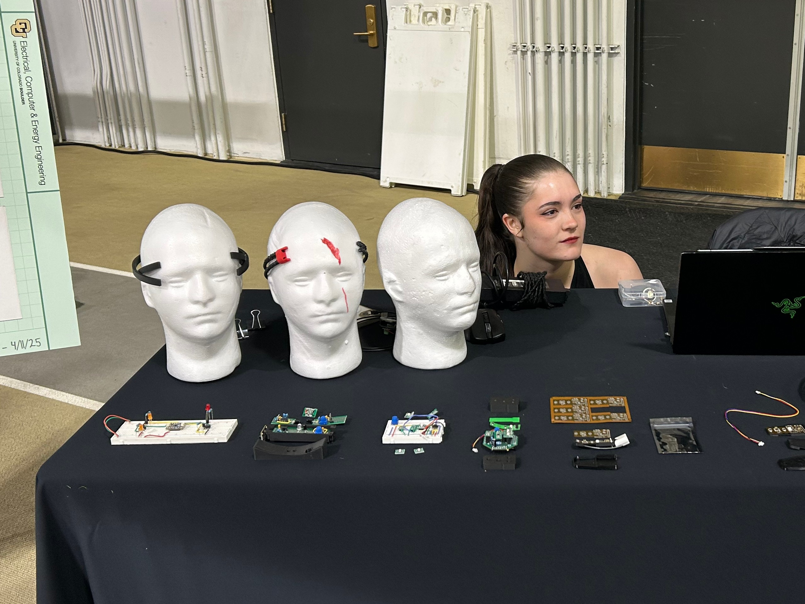
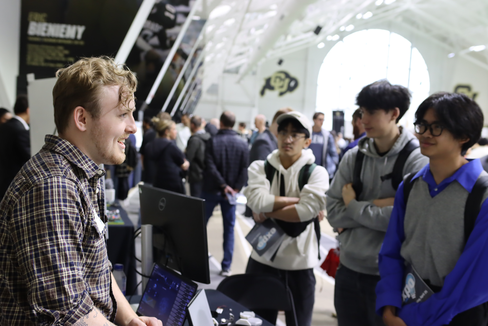
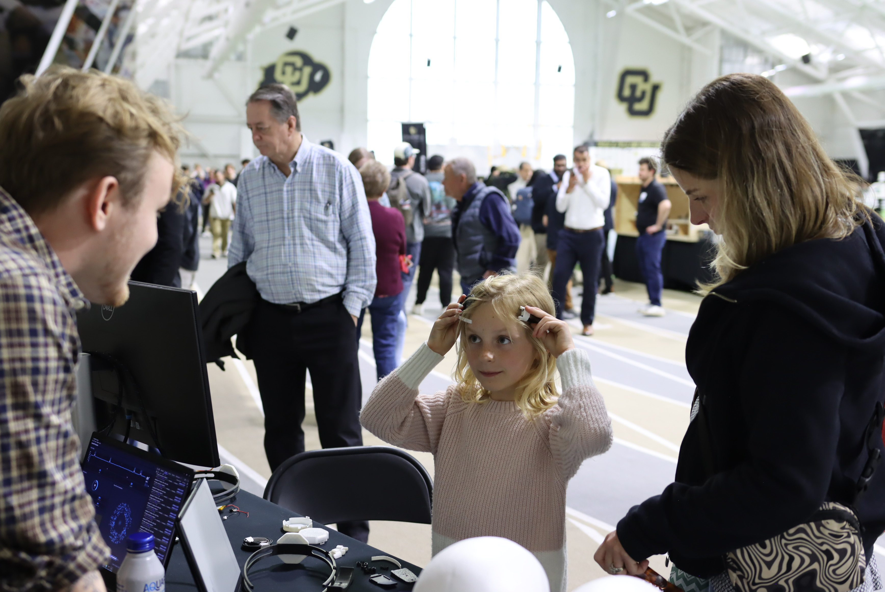
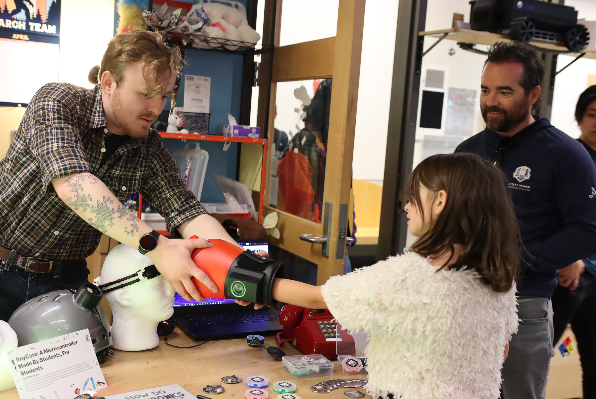
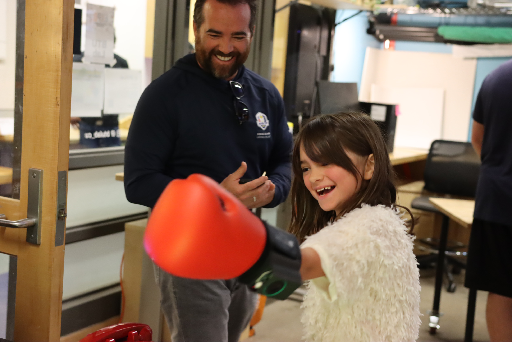
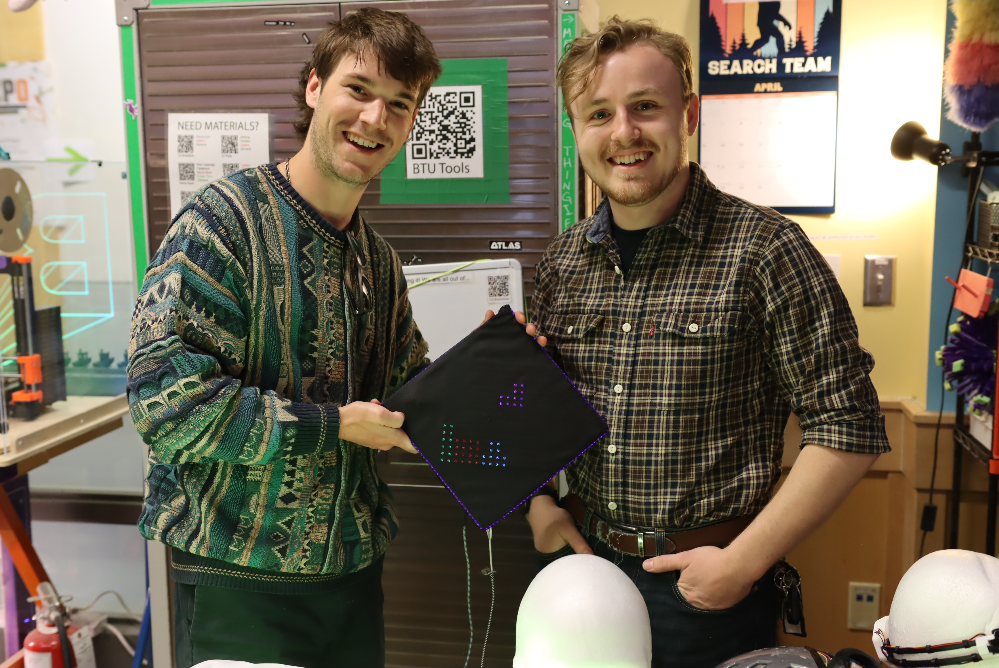
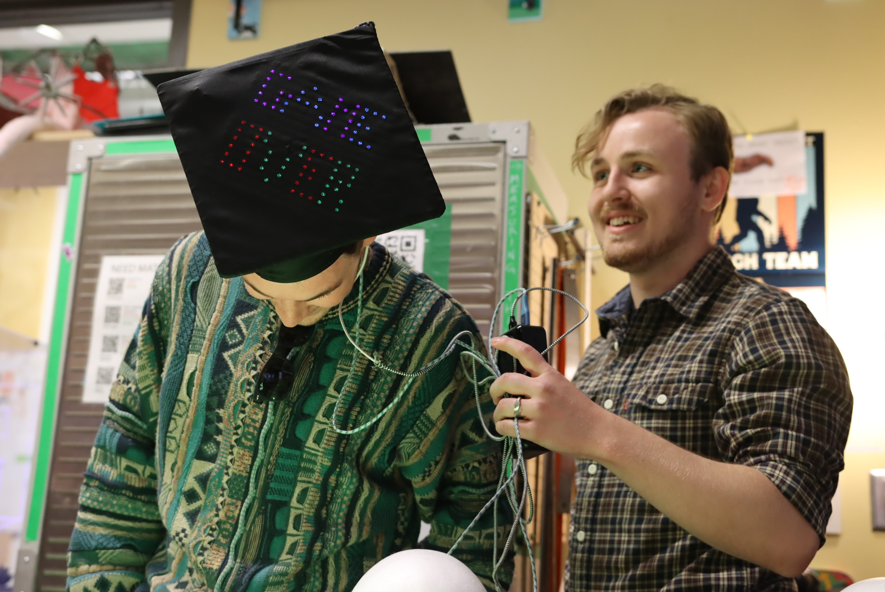

If you're keeping count, you'll noticed we missed last week, and that's because we're still a student-run company (until next semester). However, with finals over, we've got a bunch of good updates to share!
Here's what happened this week (and last):

- Presented tinyCore via OpenHEG during CU Boulder's Senior Engineering Expo
- Shared our project at CU's ATLAS Expo
- Made some banger new business cards
- Sold and tested more kits
- Refined our Kit of Parts (now with a sweet treat)
- Won a 9k Microgrant from Clear Creek Makerspace!
- Begun editing our "How it's made - tinyCore" Video

<!-- more -->

---

### Production & Fulfillment

We've updated our Kit of Parts to now include a secret sweet treat... Gummy bears! Taking inspiration from Prusa, we wanted to include a small token of gratitude with each of our initial orders. It fits our company mission of Kickass Support and striving for excellence, plus it tastes good!  

### Community & Marketing

The last two weeks included more marketing and community-building! Our two main events were Capstone (Senior Design) Expo and ATLAS Expo. We got lots of great shots, some of which I'd like to share. But before that, check out our awesome new business cards:

They're a 1-1 scale so customers can test-fit their projects before they buy! It's quite convincing too, several people at ATLAS Expo didn't realize they weren't the real thing!

  - 
  - 

  - 
  - 

/// caption
Demo-ing OpenHEG (a project build with tinyCore) at CU Boulder's Senior Design Expo
///

And our booth at ATLAS Expo:

  - 
    
    /// caption
    Demo-ing the Punch-It! to it's intended user
    ///

  - 
    
    /// caption
    Positive market validation testing
    ///

/// caption
Made by Logan B. - Computer Science major, CU Boulder
///

And in the project spotlight this week, is a project made by Keaton, a smart-LED graduation cap! He even made it on the CU Boulder Engineering Instagram! I think this is one of the most professional builds I've seen so far with tinyCore. Congrats Keaton!

  - 
    
    /// caption
    Demo of a smart graduation cap, built with tinyGlow
    ///

  - 
    
    /// caption
    Turns out Tetris is hard..
    ///

/// caption
Made by Keaton G. - Computer Science major, CU Boulder
///

### Events & Opportunities

To be honest, it seems like the events are never going to stop... but that's a good thing! Up next, we have Boulder Startup Week (May 12-16th), and then we're actively preparing for Open Sauce in July. We will keep you posted with progress as we design our booth.

### What's Next

Same as last week, there's always more work to do. Here's the agenda for next week:

1. Test and Kit our next batch of orders

2. Build out our core documentation (#KickassSupport)

3. Finish our how-we-made-it YouTube video

4. List our product on Tindie marketplace!

---

**As always, we'd love your feedback, and we've made it easier than ever to contribute! Drop us a comment below with your thoughts, projects, or questions!**

