Holy cow it was a crazy week! Open Sauce, tinySwag, TikTok, and more! 

## 🔥 Highlights
- Tested and Prepared 50 tinyCore Kits
- Designed and Built our booth
- Drove 5000 miles to present at Open Sauce!
- Started posting on socials (TikTok, Instagram, YouTube)
- Sold through all of our kits!!
- Debuted a demo of our new software: ***tinyForge***

----------

### Open Sauce

Last weekend was our first public debut of tinyCore at a convention.. and we SOLD OUT!!

The entire event was awesome, we met so many amazing people and welcomed tons of new fans to the tinyClub! Most of our time outside of Open Sauce was spent cutting business cards, folding zines, and testing the props for our booth. We also got an opportunity to demo our software and share some future tinyCore add-ons. Here's the tinyCrew in action! 

  - 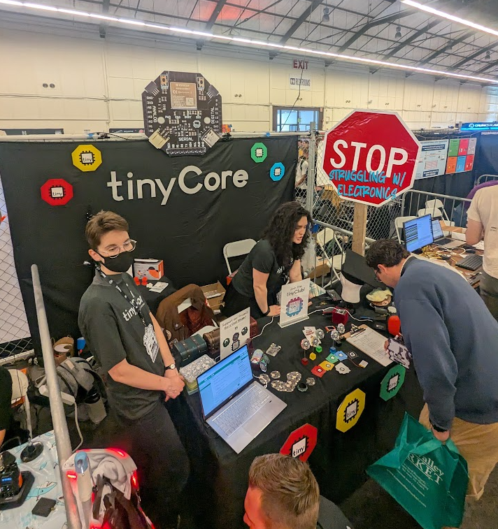
  - 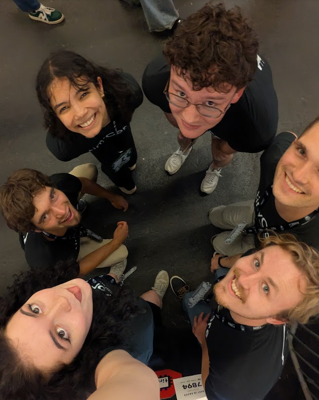

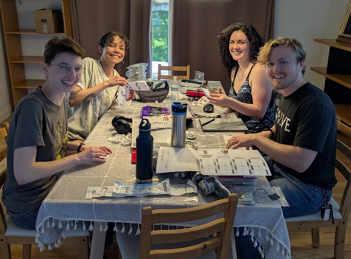

Half the team flew to San Francisco while the other half drove the 2500 miles from Colorado to California. We had a mini team road trip! 

Aiden’s mom made us custom shirts to help us look more professional :)

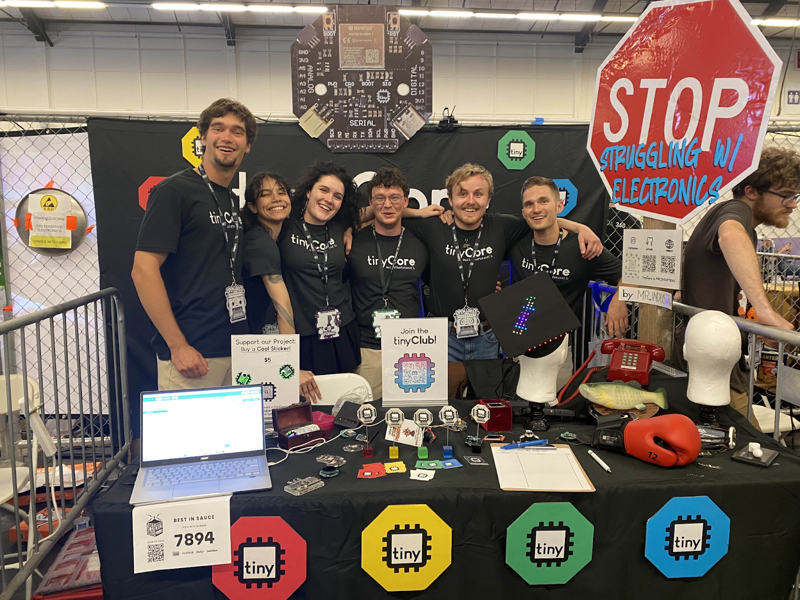

For some tinyCore swag, we ordered stickers in all of our board colors and even some shinyCore’s too. We also made our own DIY tinyCore Fridge magnets!

  - 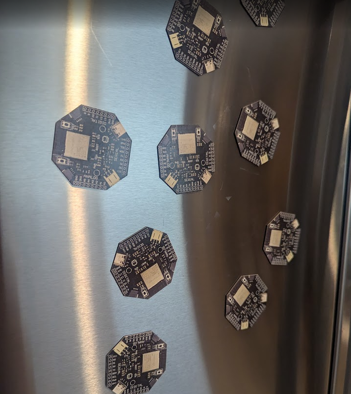
    
    /// caption
    MAGNETSSSS
    ///

  - 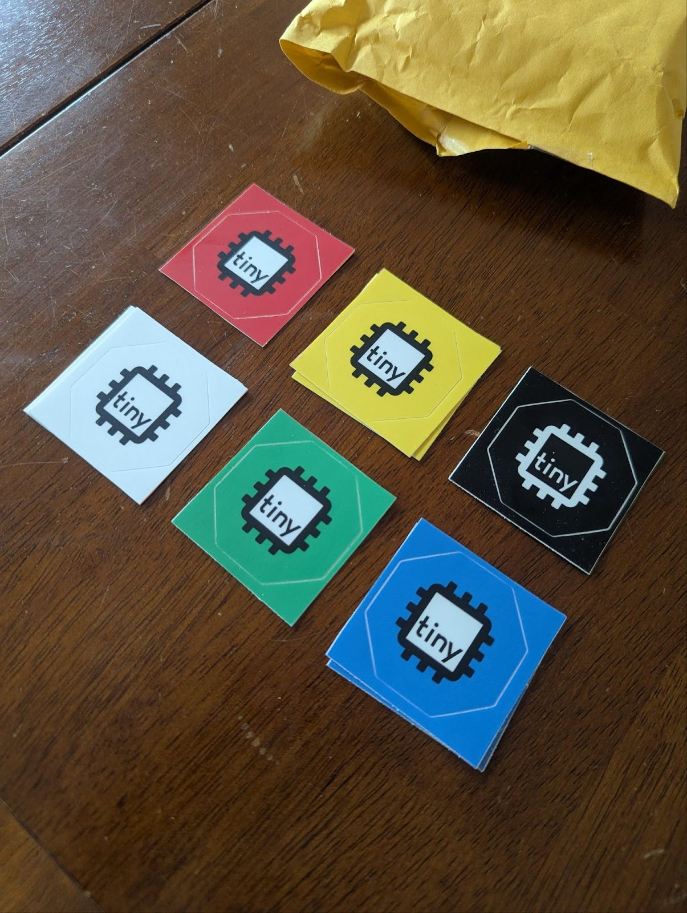

Here's us setting up the booth..

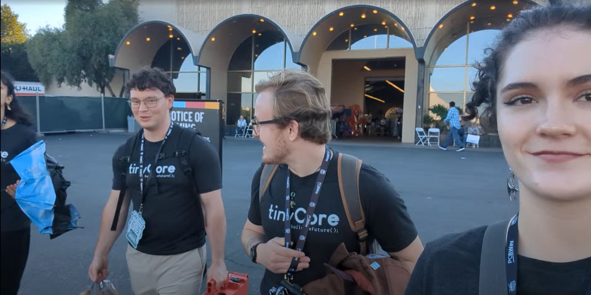

  - 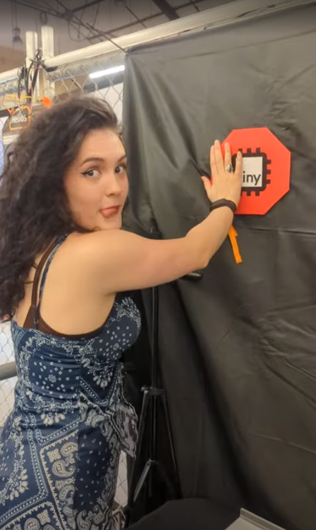
        
    /// caption
    i am hepful
    ///

  - 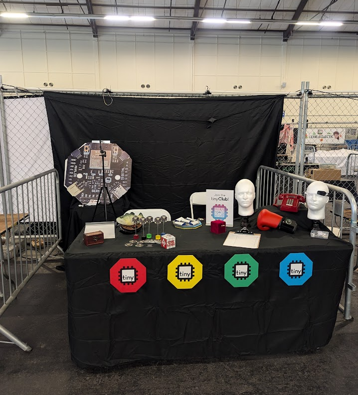
        
    /// caption
    Halfway done!
    ///

Then the team got to work selling tinyCore’s and getting the word out. People loved the project so much that we sold out of all the kits we brought. We had to start redirecting buyers to our website!

The rest of our time was spent testing boards, filming content, and team bonding at our AirBnB!
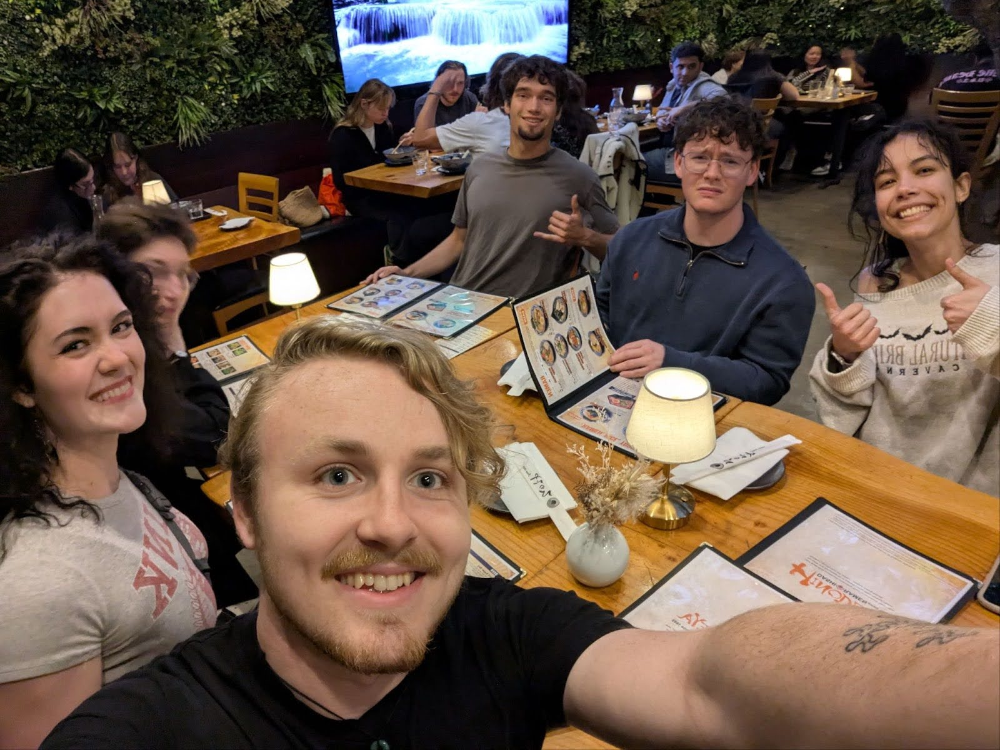

We also got to demo the eufyMake E1 for UV-printing labels on our enclosures... The results were fantastic.. Might have to buy one of these now:

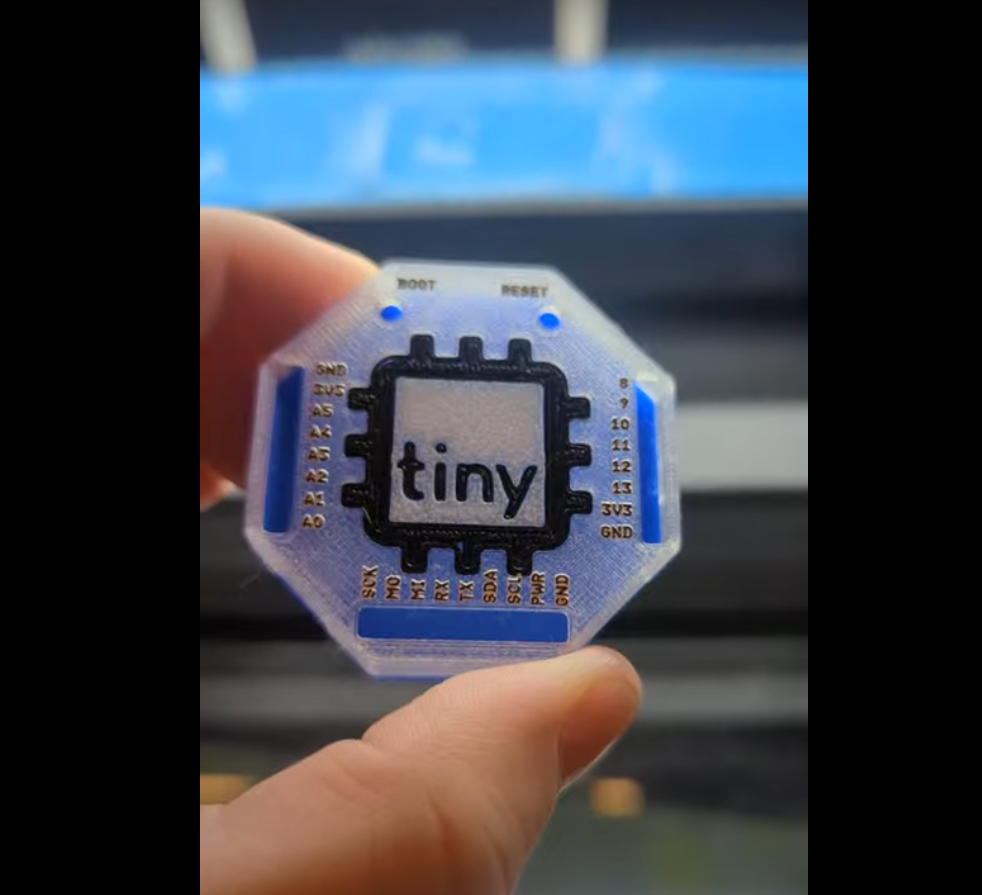

Most of this has been shared on our new social accounts!

### TikTok and Instagram
I'm not a big user of social media, but prior to leaving for Open Sauce, I realized we were gonna need socials if people wanted to follow the project. Because of that, we've updated our handle to @mister.industries for all our accounts, and opened a TikTok and Instagram under the same name. (Psssst!.. You should follow us!)

- [TikTok](https://www.tiktok.com/@mister.industries)

- [Instagram](https://www.instagram.com/mister.industries/)

Here's our shorts from Open Sauce:

https://www.tiktok.com/@mister.industries/video/7530912567179349261
https://www.tiktok.com/@mister.industries/video/7531179979657252109 

### tinyForge

For the last month, we've been developing an IDE for programming the tinyCore in the browser, and we got to reveal the demo to hundreds of people at Open Sauce! I'd like to give everyone here a preview of how it looks as well. 

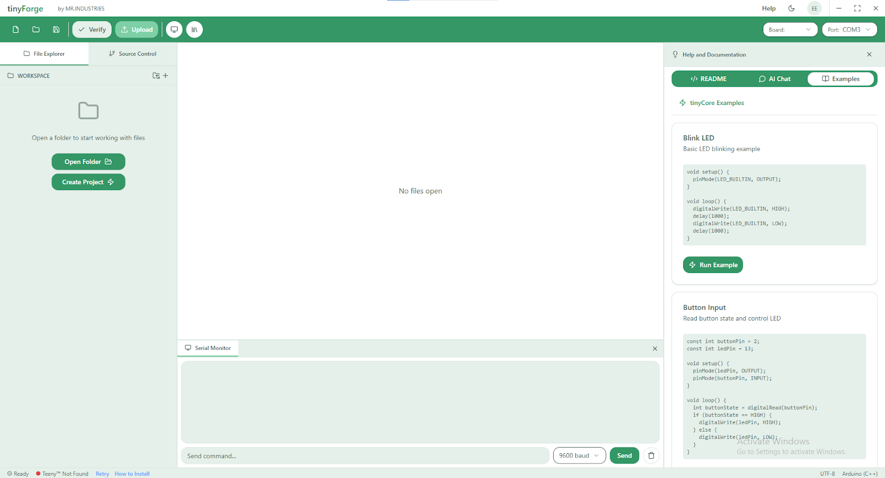

This is the main page, where you can open a project or load example code from our documentation.

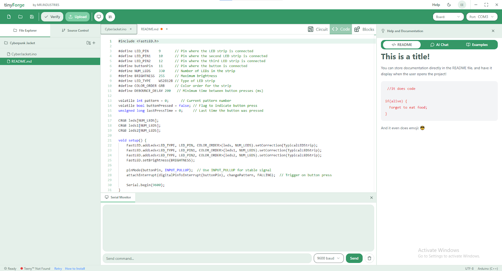

Once you’ve opened your project/GitHub repo, you can immediately view the documentation and code side-by-side, and edit with either Arduino C or Blockly! (CircuitPython will also be available in the future.)

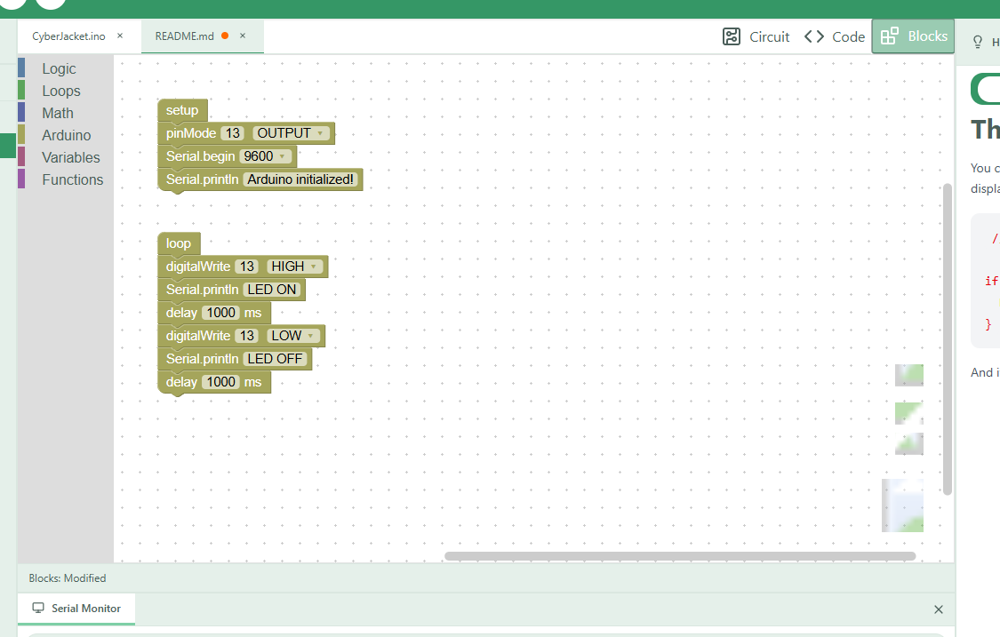

And under the circuit tab, you can view the wiring diagram for your project! (At the moment this is a static picture that will load with the project, but later we will be making this a dynamic editor.)

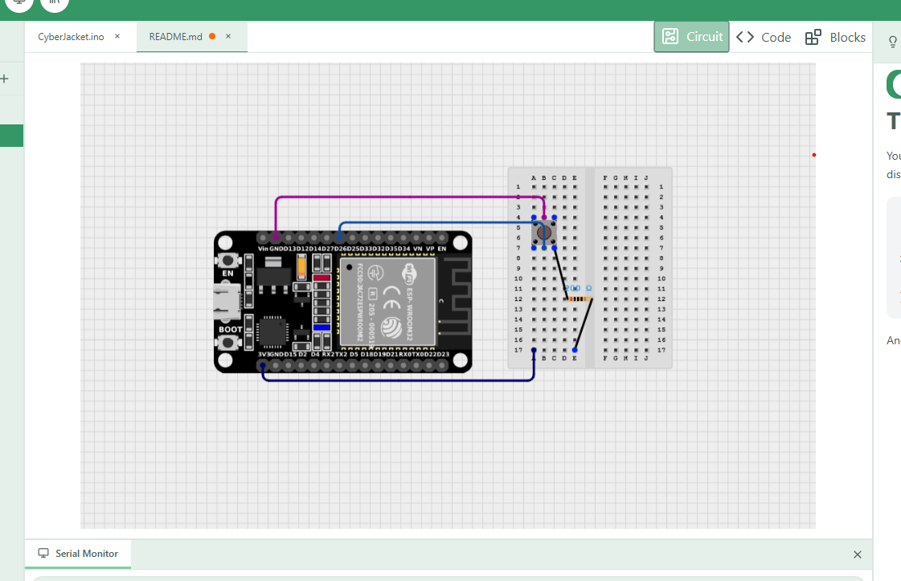

This is still very early in development, but we are hoping to share the beta within the next few months. Also, all early adopters will receive priority access and lifetime subscriptions. This is our way of saying thank you for supporting our project!

### Events & Opportunities

We're still recovering from Open Sauce, but that doesn't mean we're gonna stop. Future plans and in-person tinyCore events are as follows:

- We are currently scheduling a demo day for tinyCore at the Clear Creek Makerspace during the first week of August! 

- We're also working with the Boulder Public Library to start a tinyCore class.

- And lastly, we're developing a hackathon event for CU Boulder this coming Fall of 2025. 

All of these dates are TBA.

Thanks again for visiting us at Open Sauce!

### What's Next

- Finishing the tinyForge Beta
- Further development of the Expansion Modules
- Running Community Classes
- Further Development of our Documentation!
