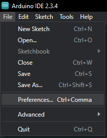
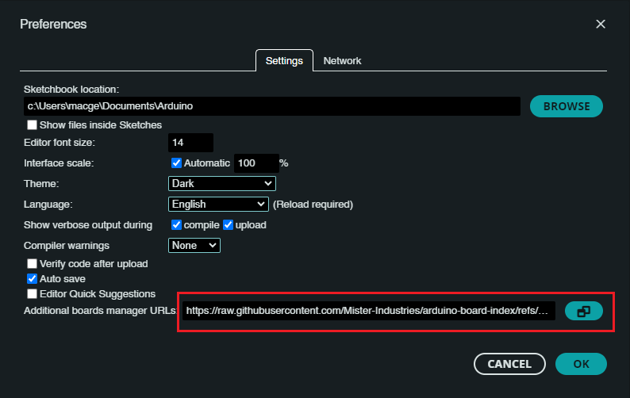
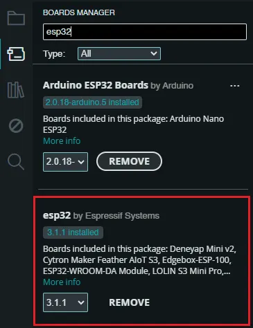
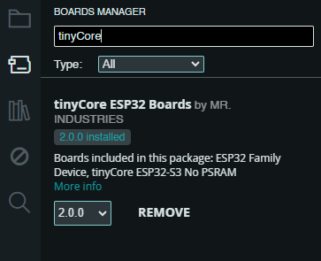
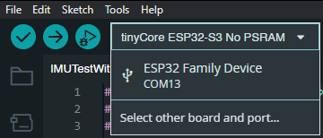
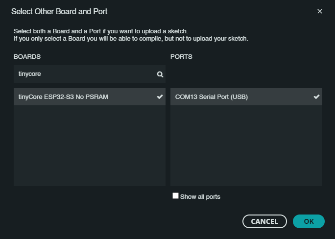
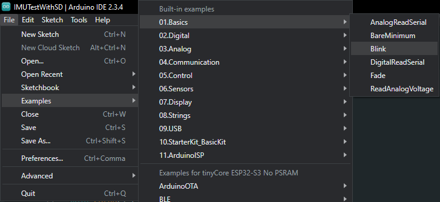
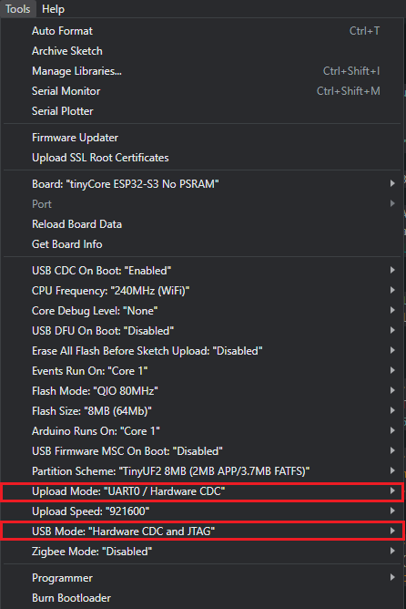
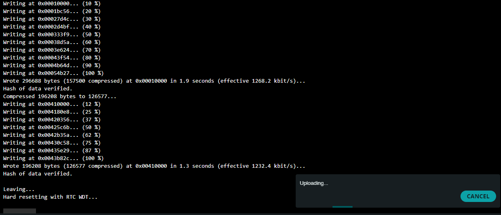
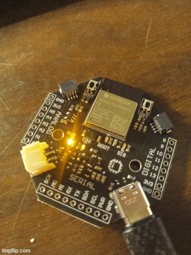

# Setup the Arduino IDE

Created: February 15, 2025 9:32 PM
Tags: Arduino, IMU
Owner: Kickass Support

## Software and Prerequisites

- [**Arduino IDE](https://docs.arduino.cc/software/ide-v2) 1.6.4 or later**
- Working internet connection

## Installation Steps

1. **First, we need to download the Arduino IDE, which can be done from the [Arduino Software page](https://www.arduino.cc/en/software/).**
2. **Install the Arduino IDE on your local machine.**
3. **Open the Arduino IDE.**
4. **Navigate to Preferences**
    ◦ File > Preferences (Windows/Linux)
    ◦ Arduino > Preferences (macOS)
    
    
    
5. **Add Custom Board Manager URL**
    ◦ In "Additional Board Manager URLs" field, paste: `https://raw.githubusercontent.com/Mister-Industries/arduino-board-index/refs/heads/main/package_tiny_core_index.json`
    ◦ For multiple URLs, separate with commas

1. **Open Board Manager**
    ◦ Tools > Board > Boards Manager
    
    *(Or press the Boards Manager Icon on the left menu:)* 
    
    
    
2. **Install ESP32 Boards/Tools**
    ◦ Search for `esp32`
    ◦ Select `esp32` package (v3.1.1) by Espressif
    ◦ Click "Install"
    
    
    
3. **Install iotaCore Custom Board**
    ◦ Search for `tinyCore`
    ◦ Select `tinyCore ESP32 Boards` package (v2.0.0) by MR.INDUSTRIES
    ◦ Click "Install"
    
    
    
4. **Plug in your tinyCore via the included USB-C Cable!**
5. Under the devices tab, you should see a new device appear. Click `Select other board and port...`

1. **Search “tinyCore”** and select `tinyCore ESP32-S3 No PSRAM` and click on the COM Port of the new device. Click OK.

1. **Now, open the Blink Example** by navigating to `File -> Examples -> 01.Basics -> Blink`

1. **Under `Tools`**, make sure that:
    
    - Upload Mode is set to `UART0 / Hardware CDC`
    - USB Mode is set to `Hardware CDC and JTAG`
    
    
    
2. **Click Upload!**
    
    The code should compile and you should see the device flash and hard reset. 
    
    
    
    The “SIG” LED should now be blinking once every second!
    
    
    
3. **Congrats! You’re ready to start building!**
- Check out our [IMU example](imu.md)

## Troubleshooting

• Verify URL is correct and accessible

• Check internet connection

• Restart Arduino IDE if installation fails

• Ensure you have the latest Arduino IDE version

## Support

Send us an email at [support@mr.industries](mailto:support@mr.industries) or join our [Discord](https://discord.gg/hvJZhwfQsF) for help!