# Setting up the IMU

Created: February 18, 2025 8:20 PM
Owner: Geoff McIntyre

⚠️ Make sure you have already installed the custom tinyCore board and setup your Arduino IDE using the [previous tutorial](arduino-ide.md)!

In this tutorial, we will walk through how to use the built-in IMU on the tinyCore V2, using the Arduino IDE. At this point, you should have already installed the custom board library and tested flashing an example program (e.g. Blink).

### 1. Install the libraries

The IMU used on the chip is the LSM6DS, which Adafruit has already made a wonderful library for: [**Adafruit_LSM6DS**](https://github.com/adafruit/Adafruit_LSM6DS/tree/master)

You can either install it manually, or click on the Library Manager icon in Arduino IDE:


Then search “Adafruit_LSM6DS” and click `INSTALL`

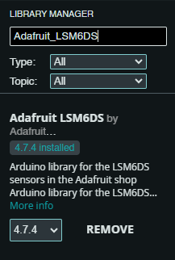

After the Adafruit Library is installed, navigate to the directory it installed to. Usually this is in `Documents → Arduino → libraries → Adafruit LSM6DS`

Now, Download our tinyCore IMU libraries, and add them into this directory.

[tinyCore_LSM6DS3TRC.cpp](imu/tinyCore_LSM6DS3TRC.cpp)

[tinyCore_LSM6DS3TRC.h](imu/tinyCore_LSM6DS3TRC.h)

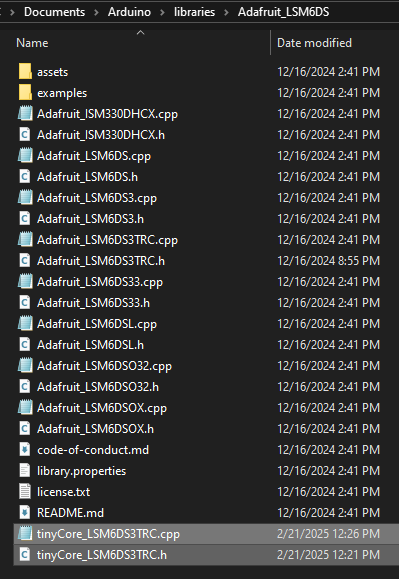

## 2. Open the Arduino Example

Our IMU example demonstrates how to initialize the IMU and view it’s data graphed out via the Serial Plotter in Arduino. To try it out, download or copy the example program below:

[IMU-Serial-Plotter.ino](imu/IMU-Serial-Plotter.ino)

```arduino
#include <tinyCore_LSM6DS3TRC.h>

tinyCore_LSM6DS3TRC lsm6ds3trc;
unsigned long lastSampleTime = 0;
const unsigned long SAMPLE_INTERVAL = 25; // Sample every 25ms

void setup() {
  Serial.begin(115200);
  /* while (!Serial) {
    delay(10);
  }*/
  
  // Initialize IMU-related pins
  pinMode(6, OUTPUT);
  digitalWrite(6, HIGH);
  
  // Initialize I2C
  Wire.begin(3, 4);
  delay(100);

  Serial.println("Scanning for I2C devices...");
  for (byte address = 1; address < 127; address++) {
    Wire.beginTransmission(address);
    byte error = Wire.endTransmission();
    if (error == 0) {
      Serial.print("I2C device found at address 0x");
      if (address < 16) {
        Serial.print("0");
      }
      Serial.println(address, HEX);
      
      // If this is our LSM6DS3TR-C address, try reading WHO_AM_I register
      if (address == 0x6A) {
        Wire.beginTransmission(0x6A);
        Wire.write(0x0F);  // WHO_AM_I register address
        Wire.endTransmission(false);
        Wire.requestFrom(0x6A, 1);
        if (Wire.available()) {
          byte whoAmI = Wire.read();
          Serial.print("WHO_AM_I register value: 0x");
          Serial.println(whoAmI, HEX);
          // Should be 0x6A for LSM6DS3TR-C
        }
      }
    }
  }

  Serial.println("Attempting to initialize LSM6DS3TR-C...");
  if (!lsm6ds3trc.begin_I2C()) {
    Serial.println("Failed to find LSM6DS3TR-C chip");
    Serial.println("Check your wiring!");
    while (1) {
      delay(10);
    }
  }

  Serial.println("LSM6DS3TR-C Found!");

  // Configure IMU settings
  lsm6ds3trc.setAccelRange(LSM6DS_ACCEL_RANGE_2_G);
  lsm6ds3trc.setGyroRange(LSM6DS_GYRO_RANGE_250_DPS);
  lsm6ds3trc.setAccelDataRate(LSM6DS_RATE_104_HZ);
  lsm6ds3trc.setGyroDataRate(LSM6DS_RATE_104_HZ);
  
  // Print labels for Serial Plotter
  Serial.println("AccelX:AccelY:AccelZ:GyroX:GyroY:GyroZ:Temp");
}

void sampleIMUData() {
  sensors_event_t accel;
  sensors_event_t gyro;
  sensors_event_t temp;
  lsm6ds3trc.getEvent(&accel, &gyro, &temp);
  
  // Format data for serial plotter (label:value:label:value format)
  Serial.print("AccelX:");
  Serial.print(accel.acceleration.x);
  Serial.print(",");
  Serial.print("AccelY:");
  Serial.print(accel.acceleration.y);
  Serial.print(",");
  Serial.print("AccelZ:");
  Serial.print(accel.acceleration.z);
  Serial.print(",");
  Serial.print("GyroX:");
  Serial.print(gyro.gyro.x);
  Serial.print(",");
  Serial.print("GyroY:");
  Serial.print(gyro.gyro.y);
  Serial.print(",");
  Serial.print("GyroZ:");
  Serial.print(gyro.gyro.z);
  Serial.print(",");
  Serial.println(temp.temperature);
}

void loop() {
  unsigned long currentTime = millis();
  
  // Sample data at specified interval
  if (currentTime - lastSampleTime >= SAMPLE_INTERVAL) {
    sampleIMUData();
    lastSampleTime = currentTime;
  }
}
```

## 3. Flash the tinyCore

Once you have the program opened in the Arduino IDE, and have connected your tinyCore via USB, it’s time to flash.

First, click the Board dropdown and `“Select other board and port…”`

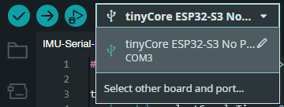

Select the correct board and COM Port of the device. Click `OK`

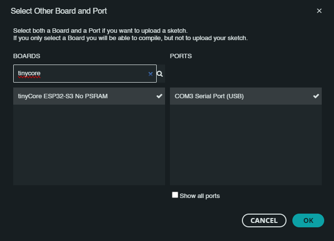

Now click the `Upload` icon, and wait for the board to reboot.


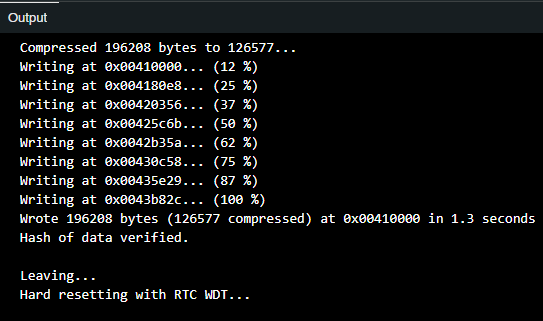

## 4. Open the Serial Plotter

The board should now be running the plotting program. Click the `Serial Plotter` icon in the top right corner of the IDE.


Ensure that you are set to the `115200 baud` bitrate (located in the bottom right corner of the IDE) 

You should now see several lines on the screen, color-coded and labeled with their variable type:

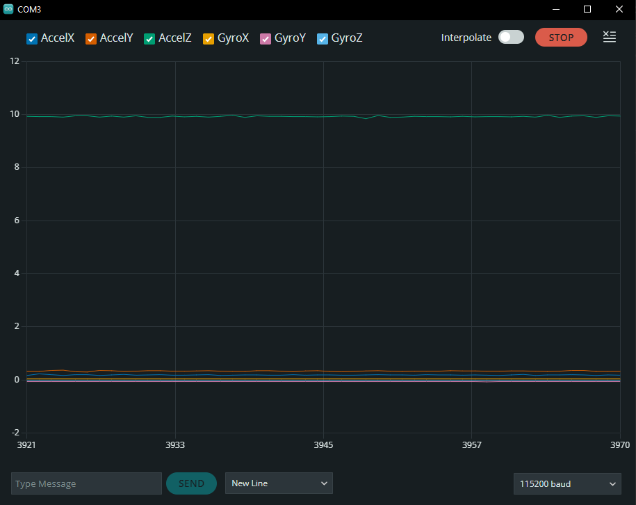

If your tinyCore is sitting up-right on a flat surface, you should see the third line (AccelZ) hovering around 9.81m/s. This is the acceleration due to gravity!

Now, if you start shaking the device, you will also see it’s movements, both accelerations and rotational movement in all six axes!

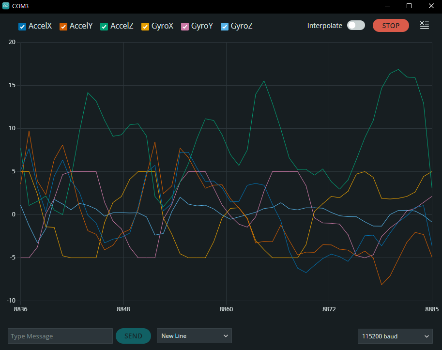

Try drawing circles in the air in different orientations, and see what shapes you can measure! Here’s my result:

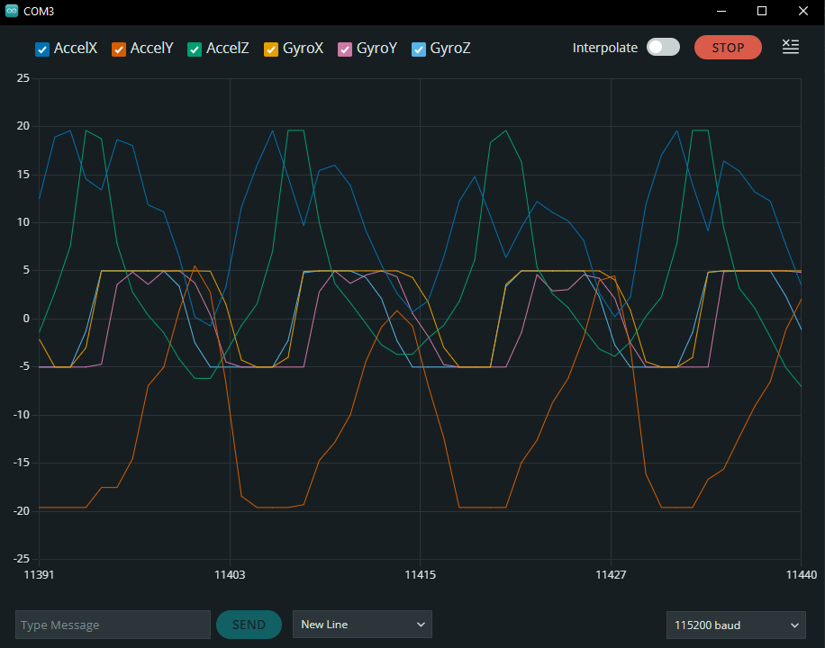

<aside>
💫

**Brain Teaser:** Can you guess what frequency I was spinning the device at?

- Click for the Answer!
    
    If we are sampling every 25ms, and there are ~13 points per rotation (one sine wave), then we know that it is 25*13=325ms per cycle. Converting this to a frequency by inverting it, we get 1/0.325, or **~3Hz!**
    
</aside>

### Extra Notes:

LSM6DS IMU Orientation:

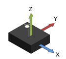

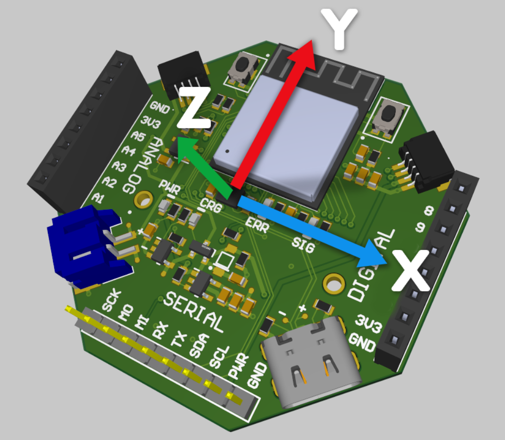

## Advanced Concepts:

### Thresholding:

Sometimes we want to remove noise from our measurements to detect a specific action or motion. The easiest way to do this is thresholding. Here’s the program I’ve setup:

[IMU-Serial-Plotter-Thresholding.ino](imu/IMU-Serial-Plotter-Thresholding.ino)

```cpp
#include <tinyCore_LSM6DS3TRC.h>

tinyCore_LSM6DS3TRC lsm6ds3trc;
unsigned long lastSampleTime = 0;
const unsigned long SAMPLE_INTERVAL = 25; // Sample every 25ms

// Z-axis threshold parameters (in m/s^2)
float Z_THRESHOLD_MIN = -5.0;  // Minimum threshold 
float Z_THRESHOLD_MAX = 5.0;   // Maximum threshold
int thresholdState = 0;        // Current threshold state (0 or 1)

void setup() {
  Serial.begin(115200);
  /* while (!Serial) {
    delay(10);
  }*/
  
  // Initialize IMU-related pins
  pinMode(6, OUTPUT);
  digitalWrite(6, HIGH);
  
  // Initialize I2C
  Wire.begin(3, 4);
  delay(100);
  
  Serial.println("Scanning for I2C devices...");
  for (byte address = 1; address < 127; address++) {
    Wire.beginTransmission(address);
    byte error = Wire.endTransmission();
    if (error == 0) {
      Serial.print("I2C device found at address 0x");
      if (address < 16) {
        Serial.print("0");
      }
      Serial.println(address, HEX);
      
      // If this is our LSM6DS3TR-C address, try reading WHO_AM_I register
      if (address == 0x6A) {
        Wire.beginTransmission(0x6A);
        Wire.write(0x0F); // WHO_AM_I register address
        Wire.endTransmission(false);
        Wire.requestFrom(0x6A, 1);
        if (Wire.available()) {
          byte whoAmI = Wire.read();
          Serial.print("WHO_AM_I register value: 0x");
          Serial.println(whoAmI, HEX); // Should be 0x6A for LSM6DS3TR-C
        }
      }
    }
  }
  
  Serial.println("Attempting to initialize LSM6DS3TR-C...");
  if (!lsm6ds3trc.begin_I2C()) {
    Serial.println("Failed to find LSM6DS3TR-C chip");
    Serial.println("Check your wiring!");
    while (1) {
      delay(10);
    }
  }
  
  Serial.println("LSM6DS3TR-C Found!");
  
  // Configure IMU settings
  lsm6ds3trc.setAccelRange(LSM6DS_ACCEL_RANGE_2_G);
  lsm6ds3trc.setGyroRange(LSM6DS_GYRO_RANGE_250_DPS);
  lsm6ds3trc.setAccelDataRate(LSM6DS_RATE_104_HZ);
  lsm6ds3trc.setGyroDataRate(LSM6DS_RATE_104_HZ);
  
  // Print labels for Serial Plotter
  Serial.println("AccelZ:ThresholdMin:ThresholdMax:ThresholdState");
}

void sampleIMUData() {
  sensors_event_t accel;
  sensors_event_t gyro;
  sensors_event_t temp;
  
  lsm6ds3trc.getEvent(&accel, &gyro, &temp);
  
  // Get Z-axis acceleration
  float accelZ = accel.acceleration.z;
  
  // Determine threshold state (1 if within thresholds, 0 if outside)
  if (accelZ >= Z_THRESHOLD_MIN && accelZ <= Z_THRESHOLD_MAX) {
    thresholdState = 0;  // Within threshold range (not triggered)
  } else {
    thresholdState = 1;  // Outside threshold range (triggered)
  }
  
  // Format data for serial plotter
  // Using the format: AccelZ, ThresholdMin, ThresholdMax, ThresholdState
  Serial.print("accelZ:");
  Serial.print(accelZ);
  Serial.print(",");
  Serial.print("T_MIN:");
  Serial.print(Z_THRESHOLD_MIN);
  Serial.print(",");
  Serial.print("T_MAX:");
  Serial.print(Z_THRESHOLD_MAX);
  Serial.print(",");
  Serial.print("State:");
  Serial.println(thresholdState * 10);  // Multiply by 10 to make it more visible in the plot
}

void loop() {
  unsigned long currentTime = millis();
  
  // Sample data at specified interval
  if (currentTime - lastSampleTime >= SAMPLE_INTERVAL) {
    sampleIMUData();
    lastSampleTime = currentTime;
  }
}
```

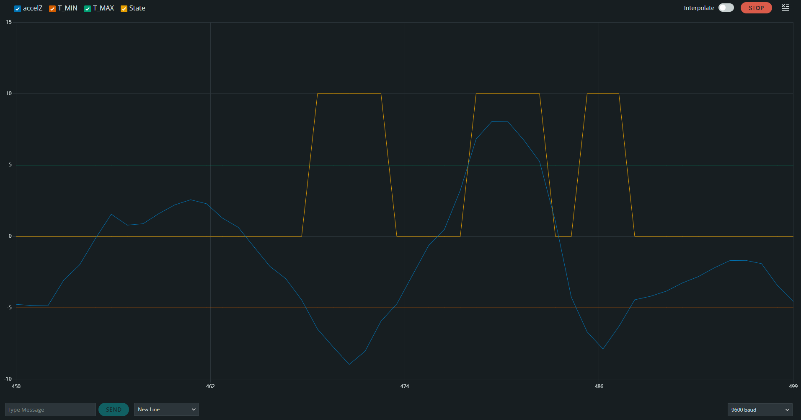

This code will take the Z-Axis (tinyCore Face side) and create a Threshold: `Z_THRESHOLD_MIN` and `Z_THRESHOLD_MAX` as well as tracking it using a `thresholdState` . You can see this on the graph, as we move the Z-axis (in blue), when we move outside of the lower and upper bound, our State will trigger. Here’s what that looks like measuring the device on a door:

| **Placement** | **Hinge Edge** | **Handle Edge** |
| --- | --- | --- |
| **Times Done** | 10 | 10 |
| **Times Detected** | 4 | 13 |

### Filtering:

Low-pass

High-pass

Band-pass

Kalman:

```cpp
#include <tinyCore_LSM6DS3TRC.h>
#include <SimpleKalmanFilter.h>

tinyCore_LSM6DS3TRC lsm6ds3trc;
unsigned long lastSampleTime = 0;
const unsigned long SAMPLE_INTERVAL = 25; // Sample every 25ms

// Z-axis threshold parameters (in m/s^2)
float Z_THRESHOLD_MIN = -5.0;  // Minimum threshold 
float Z_THRESHOLD_MAX = 5.0;   // Maximum threshold
int thresholdState = 0;        // Current threshold state (0 or 1)

// SimpleKalmanFilter parameters (e_mea, e_est, q)
// e_mea: Measurement uncertainty/noise
// e_est: Estimation uncertainty
// q: Process noise/variance
SimpleKalmanFilter simpleKalmanFilter(1.0, 0.1, 0.01);
float filteredAccelZ = 0.0;

void setup() {
  Serial.begin(115200);
  /* while (!Serial) {
    delay(10);
  }*/
  
  // Initialize IMU-related pins
  pinMode(6, OUTPUT);
  digitalWrite(6, HIGH);
  
  // Initialize I2C
  Wire.begin(3, 4);
  delay(100);
  
  Serial.println("Scanning for I2C devices...");
  for (byte address = 1; address < 127; address++) {
    Wire.beginTransmission(address);
    byte error = Wire.endTransmission();
    if (error == 0) {
      Serial.print("I2C device found at address 0x");
      if (address < 16) {
        Serial.print("0");
      }
      Serial.println(address, HEX);
      
      // If this is our LSM6DS3TR-C address, try reading WHO_AM_I register
      if (address == 0x6A) {
        Wire.beginTransmission(0x6A);
        Wire.write(0x0F); // WHO_AM_I register address
        Wire.endTransmission(false);
        Wire.requestFrom(0x6A, 1);
        if (Wire.available()) {
          byte whoAmI = Wire.read();
          Serial.print("WHO_AM_I register value: 0x");
          Serial.println(whoAmI, HEX); // Should be 0x6A for LSM6DS3TR-C
        }
      }
    }
  }
  
  Serial.println("Attempting to initialize LSM6DS3TR-C...");
  if (!lsm6ds3trc.begin_I2C()) {
    Serial.println("Failed to find LSM6DS3TR-C chip");
    Serial.println("Check your wiring!");
    while (1) {
      delay(10);
    }
  }
  
  Serial.println("LSM6DS3TR-C Found!");
  
  // Configure IMU settings
  lsm6ds3trc.setAccelRange(LSM6DS_ACCEL_RANGE_2_G);
  lsm6ds3trc.setGyroRange(LSM6DS_GYRO_RANGE_250_DPS);
  lsm6ds3trc.setAccelDataRate(LSM6DS_RATE_104_HZ);
  lsm6ds3trc.setGyroDataRate(LSM6DS_RATE_104_HZ);
  
  // Print labels for Serial Plotter
  Serial.println("RawAccelZ:FilteredAccelZ:ThresholdMin:ThresholdMax:ThresholdState");
}

void sampleIMUData() {
  sensors_event_t accel;
  sensors_event_t gyro;
  sensors_event_t temp;
  
  lsm6ds3trc.getEvent(&accel, &gyro, &temp);
  
  // Get Z-axis acceleration
  float rawAccelZ = accel.acceleration.z;
  
  // Apply SimpleKalmanFilter to smooth the data
  filteredAccelZ = simpleKalmanFilter.updateEstimate(rawAccelZ);
  
  // Determine threshold state based on filtered data (1 if outside thresholds, 0 if inside)
  if (filteredAccelZ >= Z_THRESHOLD_MIN && filteredAccelZ <= Z_THRESHOLD_MAX) {
    thresholdState = 0;  // Within threshold range (not triggered)
  } else {
    thresholdState = 1;  // Outside threshold range (triggered)
  }
  
  // Format data for serial plotter
  // Using the format: RawAccelZ, FilteredAccelZ, ThresholdMin, ThresholdMax, ThresholdState
  Serial.print(rawAccelZ);
  Serial.print(",");
  Serial.print(filteredAccelZ);
  Serial.print(",");
  Serial.print(Z_THRESHOLD_MIN);
  Serial.print(",");
  Serial.print(Z_THRESHOLD_MAX);
  Serial.print(",");
  Serial.println(thresholdState * 10);  // Multiply by 10 to make it more visible in the plot
}

void loop() {
  unsigned long currentTime = millis();
  
  // Sample data at specified interval
  if (currentTime - lastSampleTime >= SAMPLE_INTERVAL) {
    sampleIMUData();
    lastSampleTime = currentTime;
  }
}
```