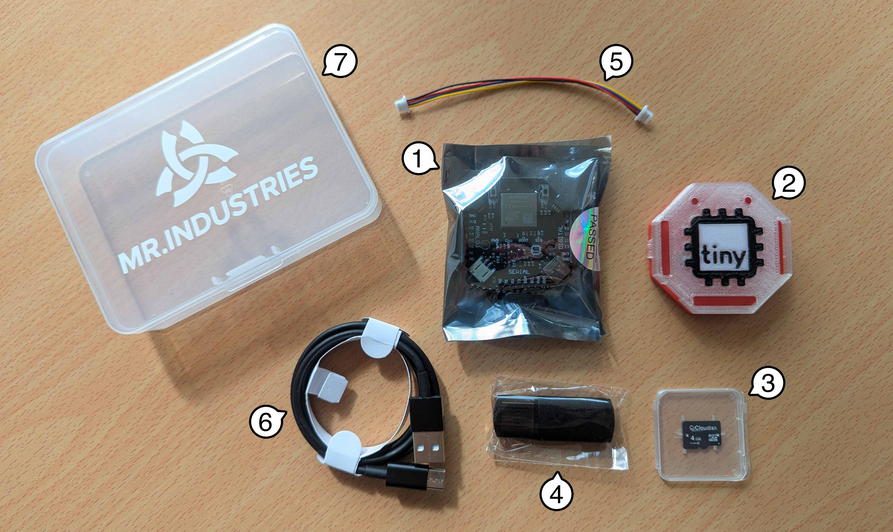
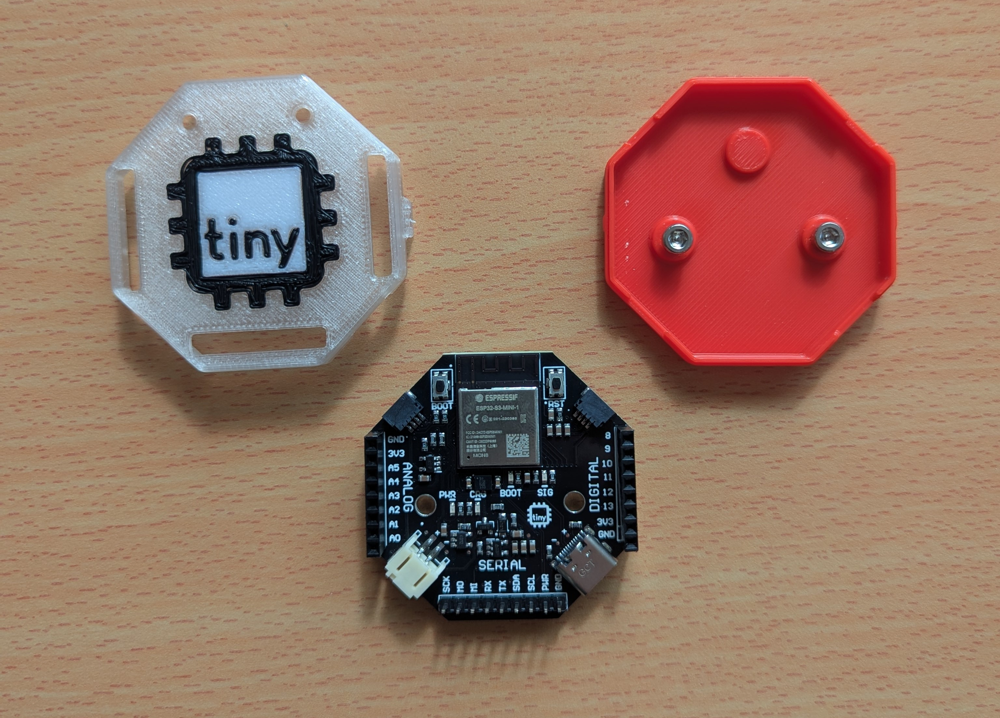
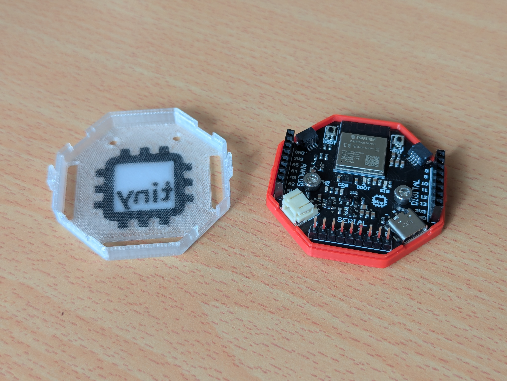
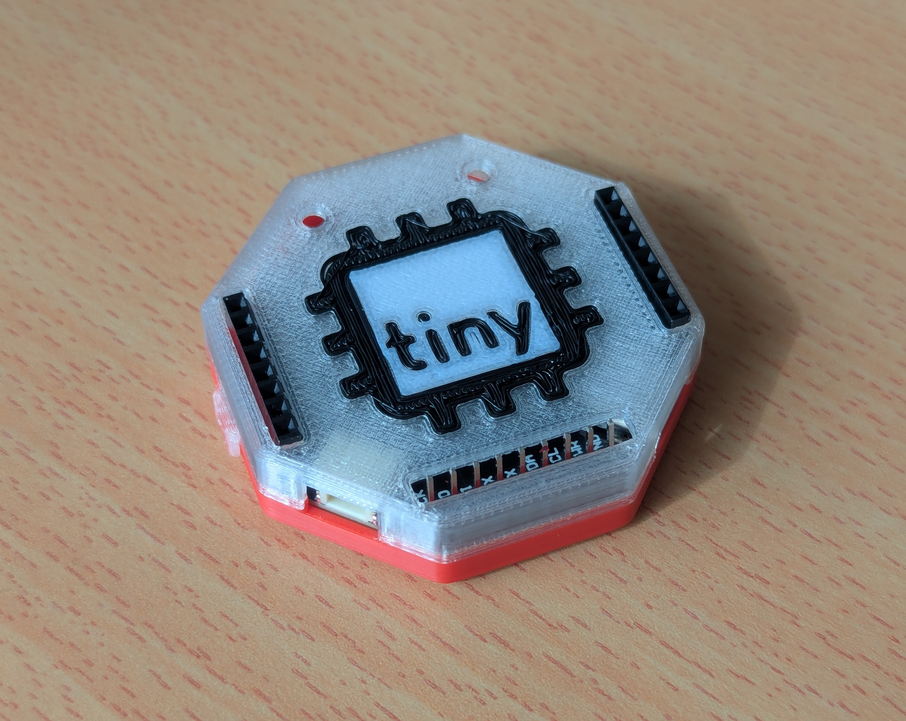

# Unboxing
---

## 1. What's Inside
---

Inside your tinyCore V2 Kit, you should find several things to help you get started:

| Label | Item        | Quantity                             |
| ----- | ----------- | :------------------------------------: |
| 1 | tinyCore V2.0 Development Board |	                        1 |
| 2 | 3D-Printed Multi-color Snap Enclosure | 	                1 | 
| NP | M3 Machine Screws (for Enclosure, don't lose these!) |   2 | 
| 3 | Micro SD Card (4GB) | 	                                1 | 
| 4 | USB Micro SD Card Reader| 	                            1 | 
| 5 | STEMMA/QWIIC Cable Connector (100cm) | 	                1 | 
| 6 | USB-C Programming Cable (1m) | 	                        1 | 
| 7 | Plastic Project Box (11.5x8.5x2.8cm) | 	                1 | 
| NP | Secret sweet treat! 🤫 | 	                           1 | 

*NP = Not Pictured*

## 2. Preparing the Headers (Optional) 

!!! warning

    As of June 2025, if you have selected pre-soldered headers during checkout, this step will not be necessary!

Here's your first big challenge: Soldering the headers!

Luckily they are "key-ed"[^1] by number, so you can only 

[^1]: "Key-ing" is a mechanical term that describes when something is designed in a way that it will only fit one way. Think of house keys!

We have three headers to solder, Two Female, and one Male (9-pins)

The female headers look like this, and are for the left and right (Digital and Analog) pins. 

Make sure they are face up on your board, then flip over the board and solder.

The male headers look like this and are for the bottom (Serial) pins. 

After soldering in the female headers, you can place in the male header pins, and solder these too. 

## 3. Assembling the Enclosure

Once the headers are soldered, we can put the PCB in the enclosure!

First, gently open up the clamshell[^2] body of the enclosure. Unclip the hinges and open up the shell. 

[^2]: Meaning two parts that fit together

Remove the screws, and place the PCB so that the screw holes line up with the holes in the enclosure. The solid plastic dot goes towards the top!

Then replace and tighten the M3 Screws provided in your kit.

!!! warning

    Do not overtighten the screws! Just make sure they are snug.

Once the PCB is fit correctly and tightened down, return the cover to it's original position, making sure that the headers align with the holes in the top.

Now your tinyCore is ready to use!