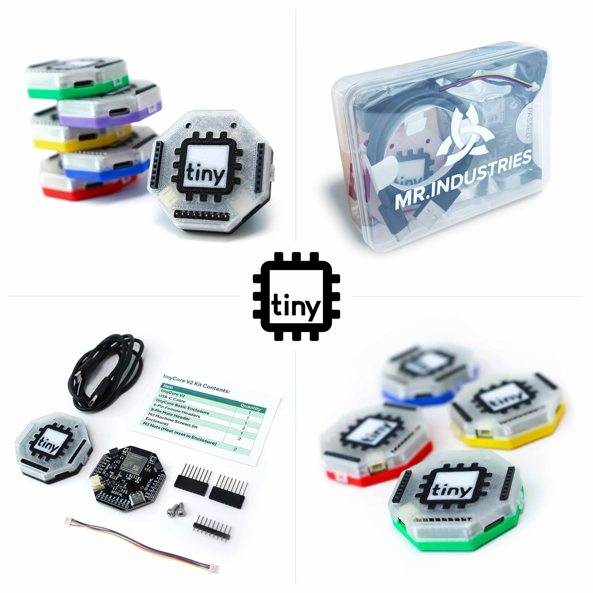

## What is tinyCore?
---

tinyCore is an engineering learning platform based around a truly open-source (open-knowledge) microcontroller designed to help educate individuals on the world of advanced embedded systems. tinyCore’s mission is to bridge the gap between undergrad and industry, equipping young professionals with the resources they need to build their portfolio and bring their ideas to life. 

:star: **Key Features:**

* Wi-Fi and Bluetooth
* USB-C Charging and Programming
* Integrated Motion Tracking
* Built-in SD Card
* Arduino IDE and CircuitPython
  

[Start Building!](get-started){ .md-button .md-button--primary }

## How to Get Involved:
---
Whether you're a seasoned engineer or a curious beginner, there's a place for you in the tinyCommunity. Follow our progress, contribute to our projects, and be part of our learning journey!

### Join the Discord
---

Our [Discord server](https://discord.gg/hvJZhwfQsF) provides weekly office hours, community hackathons, project showcases, and technical support. We'd love to see you there.
  
Stay updated with our latest developments and industry insights by following us on LinkedIn and [BlueSky](@mr.industries).

### Contributing
---

.JPG)

All contributions are welcome. Start by forking [our repository](https://github.com/Mister-Industries/tinyCore) and checking out our contribution guidelines. 

Not into coding? Help improve our documentation, share your project builds, or assist others in our Discord community.

### Share Your Thoughts
---

Your feedback is important to us! 

Share feature requests and bug reports through GitHub Issues, or reach out directly at [support@mr.industries](mailto:support@mr.industries). 

Our team reviews all suggestions and typically responds within 24 hours.

## About the Team:
---

Created by best friends, Geoff McIntyre and Aiden Reeves, tinyCore emerges from a shared vision to bridge the gap between academic engineering and industry practice.

As graduates from CU Boulder and Colorado School of Mines respectively, they have experienced firsthand the challenges new engineers face: entry-level positions demanding years of experience, and career-changers struggling to enter the field without clear pathways.

Together, they founded MR. INDUSTRIES *(pronounced "Mister")* guided by three core principles:

### **Integrity, Excellence, and Progress.**

By building in the open and putting humans first, [MR.INDUSTRIES](http://MR.INDUSTRIES) is making professional embedded development accessible to everyone.

*Aiden (left) and Geoff (right) at Clear Creek Makerspace*

## Our Amazing Sponsors
---

The tinyCore project thrives thanks to the generous support of our manufacturing and development partner:

---

[**PCBWay**](https://www.pcbway.com/project/shareproject/iota_The_Open_Source_Advanced_IoT_Learning_Platform_12776757.html) provides exceptional PCB manufacturing services and has been instrumental in bringing tinyCore to life through their reliable prototyping capabilities.

## **Want to support us?**

---

Help us advance open-source hardware development by supporting the project. Consider becoming a GitHub sponsor to help fund ongoing development and maintenance. You can also [***purchase our board!***](https://mr.industries/tiny-core) For bulk orders and custom implementations, reach out to our commercial support team at [support@mr.industries](mailto:support@mr.industries).

<aside>
💫

Monthly subscriptions through GitHub Sponsors or PCBWay directly fund new feature development and community resources. Supporters receive priority support, custom enclosure designs, and early access to new features. Together, we're making advanced microcontrollers accessible to everyone.

</aside>

## Resources:
---
[FAQ](/faq)

[User Projects](/user-spotlight)